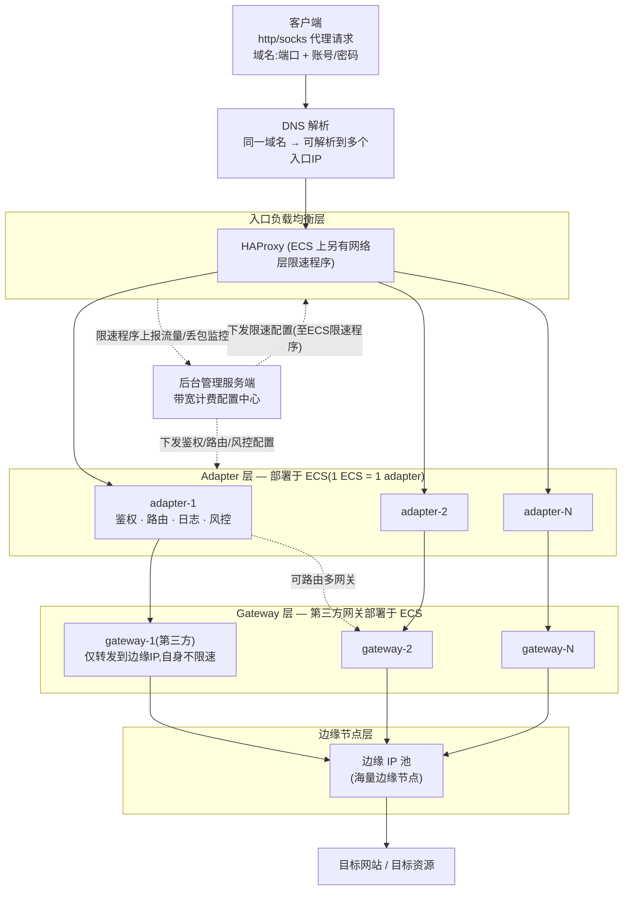

# 带宽计费限速管理功能设计

> 本文是**原始需求记录**，保留原貌。最终落地设计见
> [01-方案设计.md](01-方案设计.md)（部分原始设想经评审修订，如
> "限制新建连接"改为聚合整形、限速粒度定为按 HAProxy 节点，
> 修订理由见 [02-建议与讨论点.md](02-建议与讨论点.md)）。

现状说明： 目前后台对于带宽计费的管理几乎没有，经常出现某个环境实际已经升级过很多回了，但是后台数据一点都没有改；

## 带宽账密计费模式限速

### 定义说明

| 名词      | 定义                                                                                | 备注                                                                                                            |
| --------- | ----------------------------------------------------------------------------------- | --------------------------------------------------------------------------------------------------------------- |
| 订单/实例 | 是指用户采购并完成交易的唯一标识，用于完成鉴权、计费等管理的唯一标识                | 在带宽计费中，主要需要考虑的是总带宽是多少、使用哪几个环境                                                      |
| env       | 环境是指一组adapter服务的组合，以及adapter转发到哪些网关                            |                                                                                                                 |
| 负载均衡  | 在adapter前端会有一台或多台haproxy组成的负载均衡                                    | 负载均衡不负责业务，仅支持转发用户请求，但是在负载均衡服务器上会按照动态限速程序，限制用户请求进入；            |
| adapter   | 适配器（包括鉴权、路由、风控、日志记录等功能)，通过适配器将请求转发给各种不同的网关 | 命名是因为历史原因造成的                                                                                        |
| gateway   | 网关是指对接了很多边缘节点的服务，通过网关可以将请求转发给边缘IP；                  | 不同网关之间的转发规则不一样，因此需要adapter做兼容；网关可能由第三方提供或者自身提供                           |
| ECS       | haproxy、adapter、gateway等都部署在ECS上，ECS有自身网卡能力限制                     | 对于不同带宽的订单，应该有不同的标准配置                                                                        |
| 带宽包    | 是指云服务商提供的大小不等的带宽包                                                  | 带宽包可用于haproxy、adapter、gateway的上网；这些服务都部署在ECS上，可以理解为一个ECS部署一个adapter或者gateway |

### 架构图

1. 提供客户的物料是 http/socks代理的  域名、端口、账号、密码
2. 根据用户业务属性不同，可能存在同个域名解析到多个IP的情况
3. 入口的IP可以部署haproxy进行负载均衡
4. 负载均衡后端跟的是多个adapter
5. adapter负责鉴权、路由到哪个网关、记录日志、风控等
6. 网关层上连接很多边缘IP，负责将请求转发给边缘节点

### 设计说明

整个项目的核心诉求，是haproxy层，下行带宽（即代理请求的返回流量对应的带宽)不能高于环境约定的带宽；为此需要对所有haproxy的出流量进行监控，如果总带宽大于环境约定的带宽，则限制haproxy的新建连接，如果掉下去了，则允许新建连接；
