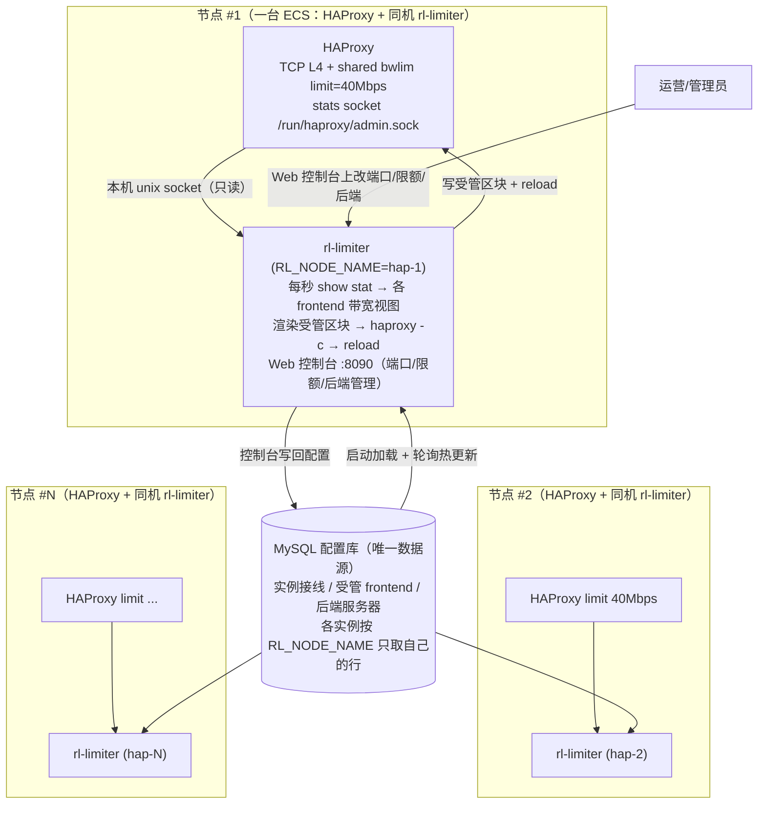

# 带宽计费限速管理 — 方案设计

> 对应需求：[00-需求说明.md](00-需求说明.md)
> 核心诉求：**HAProxy 层的下行带宽（代理请求返回给客户端的流量）不能高于约定带宽**。
> 原始需求中"限制新建连接"的手段经评审改为聚合整形（理由见 [02-建议与讨论点.md](02-建议与讨论点.md) §1）。

---

## 1. 背景与目标

### 1.1 两个要解决的问题

需求里其实包含两件事，本方案把它们拆开设计、一起交付：

1. **限速执行问题（数据面）**：实际下行带宽必须被约束在约定值以内，且要平滑（不能一刀切断流、不能来回抖动）。
2. **计费数据治理问题（管理面）**：现状是"环境升级过很多回，后台数据一点没改"。限速的前提是有一份**权威、可审计、与现场一致**的配额数据，否则限的就是错的值。

### 1.2 设计目标

| 目标 | 指标（可调） |
| ---- | ---- |
| 节点下行带宽不超其带宽限制 | 10 秒滑动窗口均值 ≤ 100% 限制；瞬时毛刺 ≤ 110% |
| 限速平滑，不误伤 | 带宽 < 90% 限制时不产生任何收紧动作；任何情况下不拒绝新建连接、不断开存量连接（资源过载保护除外） |
| 控制收敛快 | 超限后 ≤ 5 秒内开始收敛，≤ 30 秒回到限制内 |
| 配置面故障不影响数据面 | 配置库断联后按最后一次配置继续限速（fail-static） |
| 数据可信 | 配额只有一个修改入口（配置库/控制台），实际用量可实时核对 |

### 1.3 非目标（第一期不做）

- 不做单用户/单账号粒度的限速（那是 adapter 层的事，见建议文档）。
- 不做 gateway / adapter 层的带宽控制，只控 HAProxy 入口下行。
- 不替换现有计费出账系统，只提供权威配额数据和实际用量数据。

---

## 2. 总体架构

系统由三部分组成，**限速执行与监控同机、配置集中**：

- **HAProxy 节点（数据面 = 限速执行者）**：TCP L4 负载均衡，用原生
  **shared bwlim**（聚合限速，stick-table 共享速率桶）把本机受控
  frontend 的**全部连接（含存量长连接）的总速率**硬性压在限额内。限额
  是 haproxy.cfg 里的配置常量，调整 = 改配置 + reload。另有 tc 内核
  兜底，与限速主链路无关。
- **rl-limiter（Python）——与 HAProxy 同机部署**：每台 HAProxy 服务器上
  装一个实例（systemd 管理，`RL_NODE_NAME` 指定它管哪个实例）。两件事：
  ①**监控**——通过本机 unix stats socket（`level user` 只读）每秒采样
  各受管 frontend，产出带宽视图并做持续超限告警；②**配置下发**——把
  配置库里的监听端口、限额、后端服务器渲染进本机 haproxy.cfg 的受管
  区块并 reload，让改动即时落到数据面（§3.3）。内置 **Web 控制台**
  （实时曲线 + 端口/限额/后端服务器的标准化管理界面）。
- **MySQL 配置库（唯一数据源）**：HAProxy 实例接线、受管 frontend
  （监听端口/限额/模式/超时）、后端服务器全部存库；各机器的 rl-limiter
  启动时加载、运行期轮询热更新，并把它渲染进本机 haproxy.cfg。
  **限额与数据面同源**——不存在"库改了、cfg 忘了改"的漂移。

**为什么与 HAProxy 同机（v3.1 由集中监控改为同机）**：

| 维度 | 集中监控（旧） | 同机部署（现） |
| ---- | ---- | ---- |
| **限额调整** | 只能改库 + **人工**改 cfg + reload（两步流程，易漏第二步） | **改库即改数据面**：本机实例自动改 cfg + reload，~74ms 生效（§3.3）。这是同机部署的首要理由 |
| **配置漂移** | 只能被动告警，靠人去修 | 持续 reconcile **自动修复**，配置库真正成为唯一真相源 |
| stats socket 暴露面 | 每台 HAProxy 都要对内网开一个 runtime API 端口，靠安全组收敛 | 本机 unix socket，**不占任何网络端口**，按文件属组授权 |
| 故障域 | 监控服务是所有节点观测的单点；跨机网络分区会让健康节点被误判 degraded | 监控与被监控对象同生共死，一台机器的监控故障不外溢 |
| 采样时延/可靠性 | 依赖内网 RTT 与链路健康 | 本机 IPC，不经网络 |
| 跨节点视图 | 服务端可直接跨节点求和 | 每台一个控制台，跨机汇总留给后续集中后台（M4） |

代价只有最后一项：单个实例只看得到本机。这是可接受的——限速与告警本来
就是**按节点**闭环的（§2.1）。

多台机器可以共用一个配置库：每台用 `RL_NODE_NAME` 指定自己是哪个
实例，只读写属于自己的行，集中管理与集中审计因此得以保留。

**限速粒度（核心结论）**：**限额按 frontend（= 监听端口）设置**，
与 HAProxy 的 shared bwlim 机制一一对应——一个 frontend 就是一个速率桶。
一台 HAProxy 上可以有多个受管 frontend，各限各的、互不影响；机器之间
更没有任何自动调配。

> v0.3 及以前还有一层"业务环境 = 节点分组"用于跨机聚合展示。改为单
> HAProxy 模型后该层失去意义（一个实例只对一台机器负责），已整体移除；
> 需要跨机汇总时由后续的集中后台（§4 M4）从各实例取数。旧模型见
> tag `v0.3.0-colocated`。

> 为什么不做跨节点自动调配：按"各节点近期实测用量"加权动态分环境配额，
> 在对称饱和负载下会形成正反馈——权重来自实测速率，实测速率又是分配
> 结果本身，任何初始不均都会被逐轮放大直至锁死（强者愈强）。该机制已
> 从设计中移除；节点各自守住自己的限额，行为可预期、故障域清晰。



### 2.1 执行与监控的分工

| 环节 | 位置 | 周期 | 职责 |
| ------ | ---- | ---- | ---- |
| **限速执行** | 每台 HAProxy 进程内（shared bwlim） | 实时（每次转发都查共享速率桶） | 本机受控 frontend 全部连接的总速率 ≤ 配置 limit，与连接数/分布无关，存量连接持续受控 |
| **配置下发** | 同机的 rl-limiter 进程 | 配置一变即触发 + 30s 兜底 | 把监听端口/限额/后端服务器渲染进本机 haproxy.cfg 的受管区块并 reload（§3.3），并持续纠正漂移 |
| **监控告警** | 同机的 rl-limiter 进程 | 1 秒 | 采样各受管 frontend → 10s 均值 vs 限额 → 持续超限告警 + 控制台实时视图 |

每台节点是一个完整的闭环单元：限速在本机 HAProxy 进程内执行（不依赖
任何外部服务），监控也在本机进程内完成——一台节点的故障/超限不影响
其它节点，也不需要任何跨机调用。

**同机部署的代价与对策**：

| 风险 | 分析与对策 |
| ---- | ---------- |
| rl-limiter 崩溃 | **限速完全不受影响**（在同机 HAProxy 进程内执行）；只是本机监控/告警暂停，systemd `Restart=always` 拉起 |
| HAProxy 重启导致 socket 短暂消失 | 采样失败按 fail-static 处理（沿用上一秒速率），连续 10s 失败标记 degraded 并暂停超限判定；socket 回来后自动收敛 |
| 监控进程与数据面抢资源 | rl-limiter 每秒一次 `show stat`、常驻内存只有 10 分钟快照环形缓冲，CPU/内存开销相对 HAProxy 可忽略；systemd unit 里以非特权用户运行并收紧了 `ProtectSystem`/`ProtectHome` |
| 看不到兄弟节点 | 每台一个控制台，只管本机；跨机汇总留给后续集中后台（§4 M4） |
| 多一份部署单元 | 节点数量级的 rl-limiter 由配置管理统一发布；配置集中在库里，机器上只需一份环境变量 |

对比之下，**同机部署消除了旧集中形态的两类风险**：stats socket 不再
需要对内网开放（不占网络端口，按文件属组授权），跨机网络分区不再会把
健康节点误判成 degraded。

---

## 3. 关键设计

### 3.1 带宽统计口径：用 HAProxy frontend 的 `bytes_out`，不用网卡计数

要控的是"**代理请求的返回流量**"（HAProxy → 客户端方向）。两种采集方式对比：

| 方式 | 问题 |
| ---- | ---- |
| 网卡计数（/proc/net/dev） | ECS 出流量混杂了发往 adapter 的上行请求、健康检查、管理流量，口径不纯；多网卡/单网卡部署差异大 |
| **HAProxy stats socket 的 frontend `bytes_out`（选用）** | 精确等于"HAProxy 发回客户端的字节数"，与计费口径一致 |

采集方式：同机的 rl-limiter 每秒通过**本机 unix stats socket** 执行
`show stat`，取各 frontend 的 `bytes_out` 累计值，差分得到每秒速率，按
**每个 frontend 各自**维护 **10 秒滑动窗口均值**（承诺口径，超限告警
判据）和 60 秒 EWMA（趋势观测）——一个 frontend 就是一个 shared bwlim
速率桶，与限速机制一一对应，不存在跨 frontend 的聚合。瞬时毛刺不直接
触发任何告警。

**前提：每台受控 HAProxy 必须开启 `option contstats`**（连续统计）。
HAProxy 默认在**会话结束时**才把该会话的字节计入 frontend 统计——TCP
L4 下全是长连接，`bytes_out` 会长期不动、断连时一次性跳变，逐秒差分
出来的速率变成 0 与巨大脉冲交替，与网卡实际流量（iptraf-ng 等工具所
见）完全对不上；开启后计数随数据转发连续推进，逐秒速率与网卡口径
实测仅差 TCP/IP 头开销（约 2~4%）。

> 注意口径换算：`bytes_out` 是应用层字节。约定带宽如果按网络层算（含
> TCP/IP 头，约 3~5% 开销），把节点限制值调低相应比例即可。与网卡级
> 工具对照时还需注意：网卡计数含全部端口/双向流量（含后端侧转发），
> rl-limiter 只统计挂载 frontend 的下行方向。

### 3.2 限速执行机制：HAProxy shared bwlim 聚合限速，不拒绝新建连接

| 层级 | 手段 | 定位 |
| ---- | ---- | ---- |
| 主力：聚合限速 | HAProxy 原生 `filter bwlim-out` 的 **shared 模式**：本 frontend 全部连接从 stick-table 里同一个速率桶取额度，总和硬性 ≤ 配置的 `limit`（字节/秒） | 带宽控制的唯一日常手段；与连接数、单连接快慢、需求分布无关，**存量连接持续受控**；新连接照常接入，与存量共享额度 |
| 资源保护 | frontend `maxconn` 按 ECS 规格静态标定（由内存/fd 容量反推，见 §3.4），**不是限速手段** | 防止限速导致并发连接堆积耗尽服务器资源；只有逼近容量上限时新连接才会排队，属过载保护 |
| 硬兜底 | tc（TBF）在公网网卡上限速为节点限额的 115% | 内核层硬保证，与 HAProxy 无关；正常时永远打不到 |

接线形态（完整示例见
[deploy/haproxy/bwlim-example.cfg](../deploy/haproxy/bwlim-example.cfg)）：

```
listen fe_main                       # ← 由 rl-limiter 渲染进受管区块
    bind :8080
    stick-table type string len 64 size 1k expire 1h store bytes_out_rate(1s)
    filter bwlim-out rl-limit limit 5000000 key fe_name min-size 1460
    tcp-request content set-bandwidth-limit rl-limit
    server web1 10.0.0.21:9000 weight 100 check inter 2000ms
```

**为什么不用 per-stream bwlim + runtime map（曾用方案，生产事故后废弃）**：
per-stream 模式下每条连接的限速值在**建连时定格**为"聚合值 ÷ 当时并发
数"，生产实测暴露三个叠加缺陷——①存量长连接永不跟随调整（调高限额
不回升，只有重启 HAProxy 才恢复）；②按连接数均分对倾斜需求失效（空闲
连接占分母不占带宽，设 6G 实际只能跑 2G）；③限速→变慢→并发堆积→每
连接额度更小的正反馈把系统锁死在低吞吐。shared 模式限的是总量，三个
问题都不存在（限额精确性与存量即时性已在演示环境实测验证）。代价是
限额成为配置常量：动态微调（AIMD）不再需要也不再可行，调整走 §3.3 的
发布流程。

**TCP L4 特有语义**：服务端先关连接（如 HTTP `Connection: close`）时，
其 FIN 会与 bwlim 过滤器尚未放完的整形数据竞争，客户端可能收到截断的
响应。经限速入口的流量应使用 keep-alive / 由客户端侧关闭连接。

**为什么不用"限制上行带宽"来实现**：对下行做整形后，TCP 背压会**自动**
把 HAProxy 从 adapter 收数据的速率压下来（机制见 §3.4），等效于自动完成
了上行方向的限制；而请求字节量与响应字节量的比例因业务差异极大，用上行
流量做控制旋钮无法稳定映射到下行带宽。

其他说明：

- `bwlim-out` 需要 HAProxy ≥ 2.8（2.7 实验特性，2.8 起正式）；无法升级的
  存量节点降级为 tc 单层硬限（体验打折，仅作过渡）。
- shared 限额直接取约定带宽本值（10s 均值口径下即"均值 ≤ 约定带宽"），
  tc 阈值 115% 保证正常运行时两层不打架。
- 可选附层：单连接防独占上限（per-stream `default-limit` 静态值），
  防止一条连接吃满整个节点限额，见示例 cfg 注释。

### 3.3 限额调整流程（低频运维动作）与持续超限告警

限额是 HAProxy 的配置常量（原因见下"为什么必须改配置"），但**同机部署
让这个调整可以全自动**：改库即改数据面，无需人工第二步。

```text
改配置：Web 控制台上改监听端口/限额/后端服务器（或直接改配置库）
   ↓ 一个轮询周期内
本机 rl-limiter 读到变更 → 改写本机 haproxy.cfg 的 shared bwlim limit
   （bytes/s = quota_bps ÷ 8）→ haproxy -c 校验 → 原子替换 → reload
   ↓
新建连接立即按新限额；存量连接最迟在 hard-stop-after 宽限期结束时
断开重连、进入新限额。
```

这正是 rl-limiter 与 HAProxy 同机部署的**首要理由**：只有在同一台机器
上，监控服务才有可能直接改本机配置并 reload；跨机的集中服务做不到
（要么开 SSH，要么另装 agent）。由 `RL_APPLY_HAPROXY_CFG` 开启；不开启
则退回纯人工两步流程（本服务只读，改库仅更新告警基准）。

**为什么必须"改配置 + reload"，而不是 runtime API 热改**（实测 HAProxy
2.8.16，Ubuntu 24.04 自带版本）：

- **shared bwlim 的 limit 运行期改不了**。给 `set-bandwidth-limit` 带上
  动态 limit 表达式会在配置解析阶段直接被拒：`set-bandwidth-limit rule
  cannot define a limit for a shared bwlim filter`；runtime API 的命令表
  里也没有任何 bwlim/bandwidth 相关命令。
- 支持动态 limit（map + `set map` 热更）的只有 **per-stream** 形态——
  而那正是 §3.2 记载的、生产事故后废弃的方案。不能为了免 reload 退回去。

**reload 路径实测足够快，"立刻生效"名副其实**（同机、400 MB 下载、
`hard-stop-after 6s`）：

| 观测项 | 实测 |
| ---- | ---- |
| rl-limiter 完成一次应用（校验 + 原子写 + reload） | ~74 ms |
| 新 worker 接管 | ~23 ms |
| reload 后**新建**连接 | 立刻按新限额（1→4 MB/s，实测稳定 4.00 MB/s）|
| **存量**连接 | 保持旧限额，直到 hard-stop-after 宽限期结束被断开重连 |

存量连接的行为由运维自己的 `hard-stop-after` 决定，rl-limiter 不碰它：
宽限期短 = 限额调整对存量连接也快速生效（代价是长下载被断开重来），
宽限期长/不设 = 存量连接自然放完。这是业务取舍，不该由限速器代为决定。

**安全边界**（这是全系统唯一有写权限的地方，逐条都是刻意的）：

1. **只做定点数值替换，绝不重新生成整份 cfg**——运维手写的一切原样不动，
   只认受控 frontend 段里那一行 `filter bwlim-out ... limit <数字>`；
2. **reload 前必过 `haproxy -c`**，校验不过就保持原样并告警（把坏配置
   reload 进生产 = 整台机器入口挂掉，比限额没改过去严重得多）；
3. 写入是**原子**的（同目录临时文件 + rename）并留 `.rl-bak`；**reload
   失败自动回滚**，磁盘状态与运行状态始终一致；
4. **reload 命令只来自本机环境变量，绝不来自配置库**——否则拿到库写权限
   就等于在每台 HAProxy 上远程执行任意命令；
5. 双层数值防护：`quota_bps ≤ 0` 在配置校验阶段就被拒；即便绕过，
   `haproxy -c` 也会拒绝 `limit 0`（实测）。

**持续 reconcile，而不是"变更时改一次"**：应用逻辑是幂等的，除事件驱动
（配置一变立刻应用）外还有周期性兜底（默认 30s）。因此有人手改了
haproxy.cfg 也会被自动拉回配置库登记值——**配置漂移从"被动告警"变成
"自动修复"**，配置库是唯一真相源这件事由此真正成立。

要点：

- **`hard-stop-after` 是"调整对存量长连接生效"的手段**：reload 后旧
  worker 上的存量连接仍按旧限额，宽限期到期旧 worker 强制退出、连接
  断开重连进新 worker。取值 = 业务能接受的"旧限额残留时长"。
- **持续超限告警兜底检验一致性**：rl-limiter 发现节点 10s 均值持续
  （≥10s，带滞回）高于库中登记限额时打 warning 并在控制台高亮——
  通常意味着第 2 步没做或配置漂移；回落后自动解除。
- 顺序不可反：先改库（告警基准先行）再改数据面；只做第 1 步会触发
  告警提醒补做第 2 步。

### 3.4 整形会把流量堆在 HAProxy 上吗？（背压与资源分析）

结论：**不会无界堆积**。HAProxy 每条流的缓冲是固定大小（`tune.bufsize`，
默认 16KB），向客户端写不出去时就停止从上游 socket 读取 → 内核接收缓冲
填满 → TCP 窗口关小 → 压力逐级背压到 adapter → gateway → 边缘节点，最终
表现为**边缘节点从目标网站的拉取速度被拖慢**——数据留在了源头而不是
HAProxy 上。

HAProxy 上的占用有界且可计算：

```text
每连接最大占用 ≈ tune.bufsize(16KB) + 内核 server 侧 rcvbuf + 内核 client 侧 sndbuf
```

真正的风险不是"流量堆积"，而是**并发连接数上升**：整形后每个请求的服务
时间变长，同样的请求到达率下在途连接数按 Little 定律升高。对应措施：

1. 显式设置 `tune.rcvbuf.server` / `tune.sndbuf.client`（如 64KB），把每
   连接内核缓冲封顶；
2. 按内存反推 maxconn：如 8GB ECS 预留 4GB 给连接缓冲，每连接按 150KB 计
   → maxconn ≈ 2.5 万；随 ECS 规格形成标准配置表；
3. 监控并发连接数/maxconn 水位（控制台节点卡实时可见连接数），水位 > 80%
   告警，提示扩容节点而不是收紧限速。

### 3.5 配置数据模型（MySQL，已实现）

配置库四张表（建表与种子见
[deploy/mysql/init.sql](../deploy/mysql/init.sql)），rl-limiter 启动时
加载、运行期按 `RL_MYSQL_POLL_S`（默认 5s）轮询热更新：

| 表 | 内容 | 热更新 |
| ---- | ---- | ---- |
| `service_config` | 单行：日志级别、tick 周期 | 重启生效 |
| `haproxy_instances` | 一台受管 HAProxy 的 stats socket 接线（socket_path 或 host/port + 超时） | 重启生效（采样客户端启动时定型，改动会记 warning） |
| `haproxy_frontends` | 受管 frontend：监听地址端口、模式、**quota_bps 限额**、maxconn、balance、各项超时 | **热生效**并自动下发到 haproxy.cfg |
| `haproxy_servers` | 各 frontend 的后端服务器：地址端口、权重、健康检查 | **热生效**并自动下发 |

结构性约束（统一校验管线强制，YAML 与数据库同规则）：

- 被挂载的节点必须登记有效的 `quota_bps`（> 0）；
- frontend 名在实例内唯一（它同时是 stats 的 pxname 与 cfg 里的段名，
  重名会让采样数据张冠李戴）；
- 同一实例上两个 frontend 不得绑同一个地址端口（HAProxy 会起不来）；
- 名字与后端地址受字符集白名单限制——它们会被原样渲染进 haproxy.cfg，
  放宽等于允许通过配置库往配置文件注入指令；
- 配置写错时 rl-limiter 保留当前配置继续监控（fail-static）；引用了
  运行期新增节点的配置会被拒绝热应用（节点接线在启动时构建，需重启
  完成接线）。

**变更唯一入口**：限额登记只能通过配置库（控制台即写库），数据面限额
按 §3.3 发布流程与库同步——两边不一致会被持续超限告警暴露。想给客户
升级就必须先改库，数据被动保持一致。

管理面的订单/审计/对账数据模型（ORDER、QUOTA_CHANGE_LOG 等）属于后续
管理后台的范围，见 §4 里程碑 M4。

### 3.6 上线与灰度

限速在各节点 HAProxy 配置里逐台开启，天然支持按节点灰度：

1. **观测先行**：先只部署 rl-limiter 采样（HAProxy 暂不配 bwlim），
   控制台直接看"登记限额 vs 实测用量"——超限告警此时即暴露"升级过
   却没改数据"的存量烂账；
2. **逐台开启**：按节点把 shared bwlim 配置发布到 haproxy.cfg 并
   reload，一台一台放量；未开启的节点只有监控没有限速；
3. **回退**：删掉（或调大）该节点的 limit + reload 即回退，粒度同样
   是单台节点。

### 3.7 容错与失效行为

| 故障 | 行为 |
| ---- | ---- |
| rl-limiter ↔ 配置库断联 | 按**最后一次加载的配置**继续监控（fail-static）；启动阶段等待数据库就绪（最长 120s，凭据/依赖类永久错误立即失败）；单次拉取有整体超时，静默网络分区不会卡死轮询。**各节点独立轮询，配置库故障不会让某台节点"被别人拖死"** |
| rl-limiter 进程崩溃 | **限速完全不受影响**（同机 HAProxy 按最后一次下发的 limit 继续执行）；仅本机监控/告警与限额下发暂停，systemd `Restart=always` 拉起；其它节点完全不受影响 |
| 限额应用失败（cfg 不可写 / `haproxy -c` 不过 / reload 无权限） | 数据面**保持调整前的限额继续限速**，cfg 自动回滚（磁盘与运行状态一致），控制台顶部红色横幅 + 日志给出具体原因；下一轮 reconcile 自动重试。监控与告警不受影响 |
| 有人手改了 haproxy.cfg 的 limit | 周期性 reconcile（默认 30s）自动拉回配置库登记值并 reload |
| 某节点挂了多个受控 frontend | 限额自动应用跳过该节点并告警——原样各写一份会让实际总量翻倍，平均分摊又无业务依据，拆分方式须人工决定（监控与告警照常） |
| 整台节点宕机 | 该节点的限速与监控一起消失（本就没有流量经过它）；其它节点不受任何影响——同机形态下不存在"监控服务器挂了所有节点都瞎"的单点 |
| HAProxy 停止/重启，unix socket 消失 | 采样失败按 fail-static 沿用上一秒速率，连续 10s 失败标记 degraded 并在控制台标红、超限判定暂停（陈旧数据不触发告警翻转）；socket 回来后自动收敛 |
| `RL_NODE_NAME` 与配置库不一致 | 启动即失败并列出库中已登记的节点名——拼错若被容忍，服务会"看起来在跑"却什么都采不到 |
| 配置库里**任意节点**的数据写坏 | 校验在全量配置上做，**所有**节点的 rl-limiter 一起 fail-static 拒绝该快照、保留当前配置（节点独占等是跨节点不变量，只看本机校验不出来） |
| HAProxy reload（发版/改限额） | 限速由新 worker 按新配置继续执行；采集侧识别计数器回绕（沿用上一秒速率并重建基线），曲线无毛刺 |
| 时钟/计数回绕、单节点采样超时 | 差分为负或采集失败的秒，该节点沿用上一秒速率值；单节点超时（默认 500ms）不拖累整拍其他节点 |

### 3.8 可观测性（内置 Web 控制台，已实现）

rl-limiter 内置 Web 控制台（`RL_CONSOLE_PORT` 启用，`RL_CONSOLE_BIND`
指定监听地址，**默认只绑 127.0.0.1**——控制台无鉴权且带写接口；详见
[04-DockerCompose演示.md](04-DockerCompose演示.md)）。每台机器各有一个
控制台，管理并展示本机那台 HAProxy：

- **各 frontend 的带宽视图**：每个受管 frontend 一张 1s 粒度实时曲线
  （实时速率 / 10s 均值 + 限额虚线），超限徽标、利用率、并发连接数、
  采样失联标记；
- **标准化配置界面**：在卡片上直接编辑监听地址端口、模式（tcp/http）、
  限额、maxconn、balance、各项超时，以及后端服务器列表（增删改地址/
  端口/权重/健康检查）；也可新增或删除 frontend。保存即写库，随后自动
  渲染进 haproxy.cfg 并 reload（§3.3）；
- **实例信息与下发状态**：本机 stats socket 端点、采样健康；顶部横幅
  显示配置下发是否成功——失败时附 `haproxy -c` 的原始原因，并明确
  "数据面仍按调整前的配置运行"；
- **运行日志**：最近 1000 条结构化日志流式展示，按级别过滤（持续超限
  告警在此可见）；
- 同一套数据有 HTTP API（`/api/overview`、`/api/stream` SSE、
  `/api/history`），可脚本化取用。

Prometheus 指标端点、Grafana 大盘、按实例/天的用量聚合入库（峰值、P95、
超约秒数/字节量）与告警规则属后续里程碑（§4 M4），设计意图不变：用量
长期贴近限额的客户就是升级销售线索（见建议文档 §5）。

---

## 4. 实施计划（里程碑）

| 阶段 | 内容 | 出口标准 |
| ---- | ---- | -------- |
| **M1 观测模式**（先看再限） | rl-limiter 全量接入采样（HAProxy 暂不配 bwlim）；控制台观测各节点用量 vs 登记限额 | 全量节点覆盖；"登记限额 vs 实测用量"的差异直接可见（暴露"升级没改数据"的存量问题） |
| **M2 逐节点灰度限速** | 按节点把 shared bwlim 配置发布并 reload，逐台放量；tc 兜底就位 | 灰度节点总速率被压在限额内、存量连接即时受控，无客诉级抖动 |
| **M3 全量开启** | 全部节点开启限速；节点失联/reload/限额调整发布流程实测 | 全量节点受控；故障演练与 SOP 演练通过 |
| **M4 数据治理闭环** | 管理后台：变更审批+审计（含自动生成 cfg + reload 的发布自动化）、容量校验、用量聚合入库、超约告警→升级工单流程 | 配额变更 100% 留痕；对账差异自动告警 |

### 5. 代码仓库

```
rl_limiter/       # Python 3.11 + asyncio 监控服务（与 HAProxy 同机）
  model.py        #   共享领域类型（单位约定、Target/EnvQuota=监控单元、节点接线）
  haproxy.py      #   HAProxy runtime API 客户端（unix / TCP stats socket，只读采样）
  window.py       #   滑动窗口 + EWMA
  collector.py    #   采样、按监控单元聚合、节点级容错
  dbconfig.py     #   MySQL 配置源（启动加载 + 轮询热更新 + 控制台写回）
  enforcer.py     #   限额下发：改本机 haproxy.cfg 的 bwlim limit + reload（§3.3）
  config.py       #   配置解析与校验（YAML 与数据库共用同一管线）+ 按本机节点裁剪
  webconsole.py   #   内置 Web 控制台（节点视图、限额登记、日志）
  loop.py         #   1s 监控主循环（采集 → 超限判定 → 发布）
tools/            # fake_haproxy.py（联调假节点，支持 unix / TCP）
                  # random_web.py、loadgen.py（compose 演示）
deploy/           # systemd unit（同机形态）、haproxy 聚合限速配置示例、
                  # tc 脚本、mysql/init.sql
  docker/         #   node-entrypoint.sh（节点入口：haproxy + 同机 rl-limiter）、
                  #   compose 演示用的 HAProxy 配置模板
docs/
docker-compose.yml # 一键演示环境（详见 docs/04）
```
