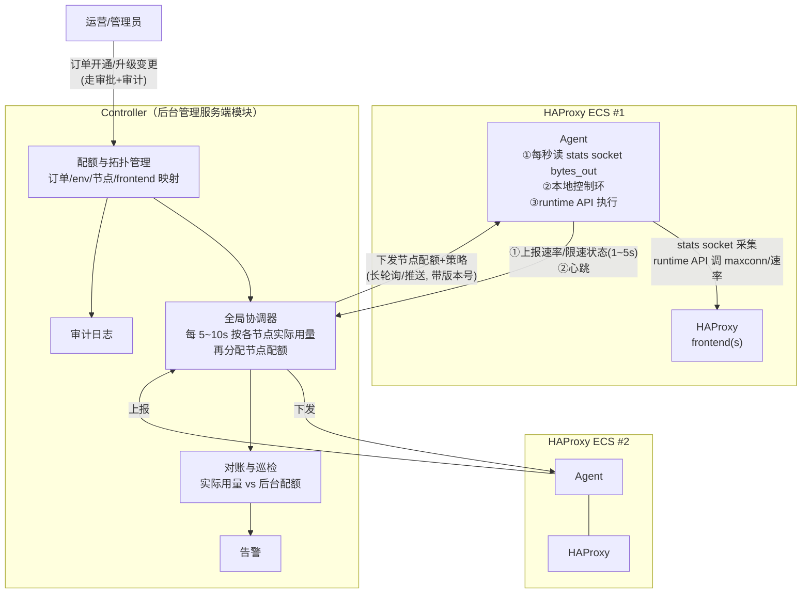
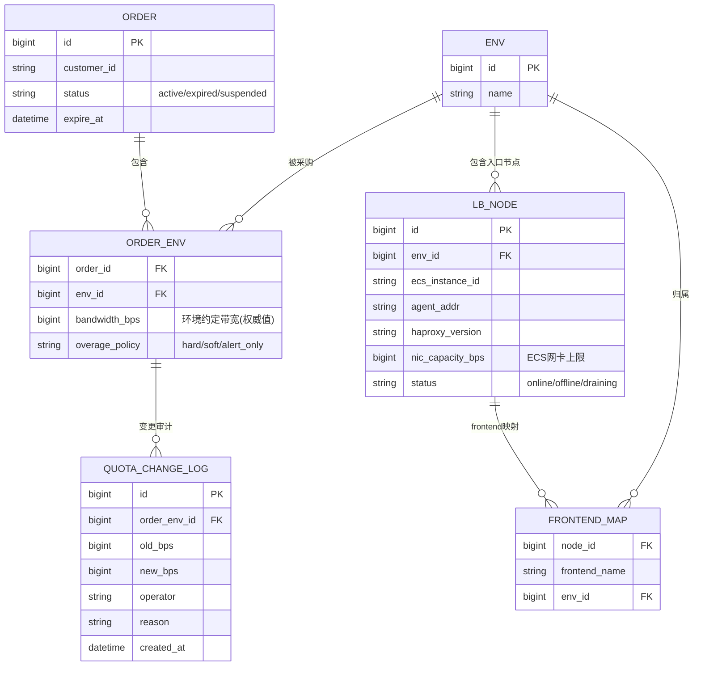

# 带宽计费限速管理 — 方案设计

> 对应需求：[00-需求说明.md](00-需求说明.md)
> 核心诉求：**HAProxy 层的下行带宽（代理请求返回给客户端的流量）不能高于环境约定带宽**。监控所有 haproxy 的出流量，超过环境约定带宽则限制新建连接，回落后恢复放行。

---

## 1. 背景与目标

### 1.1 两个要解决的问题

需求里其实包含两件事，本方案把它们拆开设计、一起交付：

1. **限速执行问题（数据面）**：环境的实际下行带宽必须被约束在约定值以内，且要平滑（不能一刀切断流、不能来回抖动）。
2. **计费数据治理问题（管理面）**：现状是"环境升级过很多回，后台数据一点没改"。限速的前提是后台有一份**权威、可审计、与现场一致**的配额数据，否则限的就是错的值。

### 1.2 设计目标

| 目标 | 指标（建议初始值，可调） |
| ---- | ---- |
| 环境下行带宽不超约定值 | 10 秒滑动窗口均值 ≤ 100% 配额；瞬时毛刺 ≤ 110% |
| 限速平滑，不误伤 | 带宽 < 90% 配额时不产生任何限制动作 |
| 控制收敛快 | 超限后 ≤ 5 秒内开始收敛，≤ 30 秒回到配额内 |
| 控制面故障不影响数据面 | Agent 断联后按最后一次配置继续独立限速 |
| 数据可信 | 每次配额变更有审计记录；实际用量与后台配额自动对账 |

### 1.3 非目标（第一期不做）

- 不做单用户/单账号粒度的限速（那是 adapter 层的事，见建议文档）。
- 不做 gateway / adapter 层的带宽控制，只控 HAProxy 入口下行。
- 不替换现有计费出账系统，只提供权威配额数据和实际用量数据。

---

## 2. 总体架构

系统由两部分组成：

- **Agent（限速代理）**：每台 HAProxy ECS 部署一个，负责"采集 → 决策（本地快环）→ 执行"。
- **Controller（控制面）**：后台管理服务端的一个模块，负责"配额管理 → 多节点协调（全局慢环）→ 对账 → 审计 → 告警"。



### 2.1 快环 + 慢环的双层控制（核心结构）

| 控制环 | 位置 | 周期 | 职责 |
| ------ | ---- | ---- | ---- |
| **本地快环** | Agent | 1 秒 | 保证**本节点**下行速率 ≤ 本节点配额。断网也能工作。 |
| **全局慢环** | Controller | 5~10 秒 | 保证**环境**总带宽 ≤ 环境配额：把环境配额按各节点近期实际用量加权切分，重新下发各节点配额。 |

这样设计的原因：

- 环境通常由多台 haproxy 组成（DNS 解析到多个入口 IP），"环境总带宽"必须跨节点聚合，但把每一次限速决策都放中心会引入网络时延和单点故障。
- 快环只依赖本地数据，秒级响应、天然容灾；慢环只做粗粒度的配额再平衡，对时延不敏感。
- 节点间流量不均（DNS 轮询不保证均匀）时，慢环自动把配额从空闲节点挪给繁忙节点，避免"总量没超但某节点被冤枉限速"。

节点配额分配算法（慢环，每周期执行）：

```text
输入: env_quota, 各节点近 60s EWMA 用量 usage[i]
保底: floor[i] = env_quota * 5% / N        # 每节点保底，防止饿死
剩余: rest = env_quota - Σfloor
分配: node_quota[i] = floor[i] + rest * usage[i] / Σusage   # 按用量加权
     (Σusage == 0 时平均分配)
约束: Σnode_quota == env_quota             # 恒等，保证环境总量不超
```

---

## 3. 关键设计

### 3.1 带宽统计口径：用 HAProxy frontend 的 `bytes_out`，不用网卡计数

需求要控的是"**代理请求的返回流量**"（HAProxy → 客户端方向）。两种采集方式对比：

| 方式 | 问题 |
| ---- | ---- |
| 网卡计数（/proc/net/dev） | ECS 出流量混杂了发往 adapter 的上行请求、健康检查、管理流量、Agent 自身上报流量，口径不纯；多网卡/单网卡部署差异大 |
| **HAProxy stats socket 的 frontend `bytes_out`（选用）** | 精确等于"HAProxy 发回客户端的字节数"，与计费口径一致；且天然按 frontend 拆分，支持一台 haproxy 服务多个环境 |

采集方式：Agent 每秒通过 unix stats socket 执行 `show stat`，取各 frontend 的 `bytes_out` 累计值，差分得到每秒速率，再做 EWMA 平滑（α≈0.3，约 3 秒时间常数），削掉瞬时毛刺，避免限速抖动。

**frontend ↔ env 映射**：Controller 维护 `节点 + frontend 名 → env` 的映射表并随配置下发。一台 haproxy 只服务一个环境时映射是平凡的；将来一台 haproxy 复用给多个环境（不同端口/域名 = 不同 frontend）时，本方案不需要改动。

> 注意口径换算：`bytes_out` 是应用层字节。约定带宽如果按网络层算（含 TCP/IP 头，约 3~5% 开销），在配额上乘一个系数（如 0.95）即可，做成可配置项。

### 3.2 限速执行机制：三层手段，渐进使用

只靠"限制新建连接"有一个根本缺陷：**代理场景大量使用长连接，超限往往是存量连接的大流量下载造成的，此时不让建新连接既压不住带宽，又把无辜的新用户挡在门外**。因此执行手段设计为三层：

| 层级 | 手段 | 特点 | 何时使用 |
| ---- | ---- | ---- | -------- |
| L1 准入控制 | HAProxy runtime API：`set maxconn frontend`；stick-table `conn_rate` + `tcp-request connection reject` 控制新建速率 | 温和，只影响新连接 | 用量 90%~100%，渐进收紧 |
| L2 带宽整形（**主力**） | HAProxy 原生 `filter bwlim-out` + 共享 stick-table（key 固定为 frontend 名 → 全 frontend 共享一个聚合限速额度），限速值由 Agent 通过 runtime API 动态改 stick-table/`set-bandwidth-limit` 参数 | 直接压制**存量连接**的下行速率，真正保证不超配额 | 用量 ≥ 100%，或 L1 收紧后 5 秒仍未回落 |
| L3 硬兜底 | tc（HTB/TBF）在公网网卡上限速为配额的 115% | 内核层硬保证，与 HAProxy 无关，防 Agent/HAProxy 异常 | 常驻，静态配置，正常时永远打不到 |

说明：

- `bwlim-out` 需要 HAProxy ≥ 2.8（2.7 实验特性，2.8 起正式）。**建议全量升级到 2.8 LTS**；无法升级的存量节点降级为 L1+L3 组合（效果打折，见建议文档 §2）。
- L3 的 tc 是"保险丝"而非日常手段：它按网卡整形、口径不纯，且丢包式限速对用户体验差，所以阈值放在 115%，只防极端故障。
- 需求原文的"限制新建连接/恢复新建连接"对应 L1，本方案保留它作为第一档温和手段，但**不作为唯一手段**。

### 3.3 本地快环控制算法（Agent，每秒执行）

带滞回（hysteresis）的分档状态机，避免在阈值附近来回震荡：

```text
输入: rate = EWMA(本节点该 env 各 frontend bytes_out 速率之和)
      quota = 控制面下发的本节点配额
      u = rate / quota

状态机（每秒评估一次）:
  NORMAL      (u < 0.90 持续 ≥ 5s):
      解除所有限制: maxconn 恢复满值, conn-rate 恢复满值, bwlim 设为 quota*1.05
  THROTTLE_L1 (0.90 ≤ u < 1.00):
      每秒把 允许新建连接速率 乘以 0.9（乘性收紧）
      maxconn 目标 = 当前活跃连接数 * 1.05（只封顶，不踢存量）
  THROTTLE_L2 (u ≥ 1.00, 或 L1 状态持续 5s 且 u 未下降):
      bwlim 限速值 = quota（把存量连接总下行压到配额）
      新建连接速率再乘 0.7
  恢复方向（u 回落穿过阈值时）:
      加性放松: 每秒恢复 5% 额度（AIMD——急收慢放, 防止振荡）
```

要点：

- **急收慢放（AIMD）**：超限时乘性收紧（×0.9 / ×0.7），恢复时加性放松（+5%/s），这是经过 TCP 拥塞控制验证的稳定结构，能防止"限速→带宽掉→放开→又超→再限"的锯齿。
- **不踢存量连接**：任何状态都不主动断开已建立的连接（`shutdown session` 不用），存量流量由 bwlim 压制。断连对代理用户是最差体验，且会引发客户端重试风暴。
- 所有阈值（0.90 / 1.00 / 5s / ×0.9 / +5%）均为策略参数，由 Controller 下发，可按环境覆盖。

### 3.4 数据模型（管理面）



配套约束与流程：

- **配额变更只有一个入口**：管理后台的变更接口（带操作人、原因、审批），写 `QUOTA_CHANGE_LOG`，然后自动触发配置下发。杜绝"现场升级了、后台没改"——现场没有第二个改配额的通道。
- **容量校验**：变更时校验 `env 配额 ≤ Σ节点网卡能力 * 安全系数`，不满足则提示先扩容节点（对应需求中"不同带宽订单应有不同标准配置"）。
- 实时用量明细走时序库（Prometheus/VictoriaMetrics），关系库只存配置与审计。

### 3.5 Agent ⇆ Controller 接口

| 接口 | 方向 | 频率 | 内容 |
| ---- | ---- | ---- | ---- |
| `GET /v1/agent/config`（长轮询，带 `config_version`） | Agent ← Controller | 变更即回，否则 30s 超时重连 | 节点配额、frontend↔env 映射、策略参数、阈值；**带版本号，Agent 幂等应用** |
| `POST /v1/agent/metrics` | Agent → Controller | 每 5s 批量（含每秒明细） | 各 frontend 速率、活跃连接数、当前限速状态/档位、限速动作事件 |
| `POST /v1/agent/heartbeat` | Agent → Controller | 每 10s | agent 版本、haproxy 版本/状态、tc 规则校验结果 |

安全：Agent 与 Controller 之间 mTLS，双向认证；节点证书与 `LB_NODE` 绑定，防伪造上报/伪造下发。

### 3.6 容错与失效行为

| 故障 | 行为 |
| ---- | ---- |
| Agent ↔ Controller 断联 | Agent 按**最后一次下发的节点配额**继续本地限速（fail-static），绝不放开为不限速；恢复后先拉全量配置 |
| Agent 进程崩溃 | systemd 自动拉起；崩溃期间 L3 tc 兜底仍在内核生效；HAProxy 上残留的限速值保持原样（安全方向） |
| HAProxy reload（发版/改配置） | stick-table 用 `peers` 机制在 reload 间保留；Agent 检测到 reload 后 3 秒内重新应用限速值 |
| Controller 宕机 | 所有 Agent fail-static；Controller 无状态化 + 多副本部署，配置存 DB |
| 某节点 Agent 失联但 HAProxy 仍在服务 | 慢环把该节点视为"按最后已知用量占用配额"，不把它的份额分给别人（保守），并触发告警 |
| 时钟/计数回绕、stats socket 超时 | 差分为负或采集失败的秒，沿用上一秒 EWMA 值，连续 10s 失败则告警并保持当前限速档位 |

### 3.7 可观测性与告警

- Agent 暴露 Prometheus 指标：`rl_rate_bps{env,node,frontend}`、`rl_quota_bps`、`rl_state`（0/1/2 档）、`rl_reject_conn_total`、`rl_bwlim_active`。
- Grafana 大盘：环境视角（总用量 vs 配额、各节点堆叠）、节点视角、限速事件流水。
- 告警规则（初始）：
  - 环境用量 > 95% 配额持续 10 分钟 → 通知运营（**升级销售线索**，见建议文档 §5）；
  - 触发 L2 限速持续 5 分钟 → 通知值班；
  - Agent 失联 > 1 分钟 / tc 兜底被打到 → 高优告警。

---

## 4. 实施计划（里程碑）

| 阶段 | 内容 | 出口标准 |
| ---- | ---- | -------- |
| **M1 观测模式**（先看再限） | Agent 只采集上报不执行；Controller 落数据模型 + 大盘 + 对账报表 | 全量节点覆盖；后台配额与实测用量的差异报表跑通（直接暴露"升级没改数据"的存量问题） |
| **M2 单节点限速** | 快环 + L1/L2/L3 执行，选 1~2 个环境灰度（先 dry-run 打日志，再真执行） | 灰度环境 10s 均值不超配额，无客诉级抖动 |
| **M3 多节点协调** | 慢环配额再分配、节点失联保守策略 | 多 haproxy 环境总量受控，节点间流量不均时无误限 |
| **M4 数据治理闭环** | 变更审批+审计、容量校验、超约告警→升级工单流程 | 配额变更 100% 走后台留痕；对账差异自动告警 |

先 M1 后 M2 的原因：不需要任何风险动作就能先解决"后台数据与现实脱节"的痛点，同时为限速阈值调参积累真实数据。

---

## 5. 代码仓库规划

```
agent/          # Go（建议）：单二进制、低内存、systemd 部署
  collector/    #   stats socket 采集 + EWMA
  governor/     #   状态机（快环）
  executor/     #   runtime API / stick-table / tc 执行器
  reporter/     #   上报、心跳、配置长轮询
controller/     # 控制面服务（可并入现有后台管理服务端）
  api/          #   agent 接口 + 管理接口
  coordinator/  #   慢环配额分配
  reconcile/    #   对账巡检
deploy/         # systemd unit、haproxy 配置片段(bwlim/stick-table/peers)、tc 脚本
docs/
```
