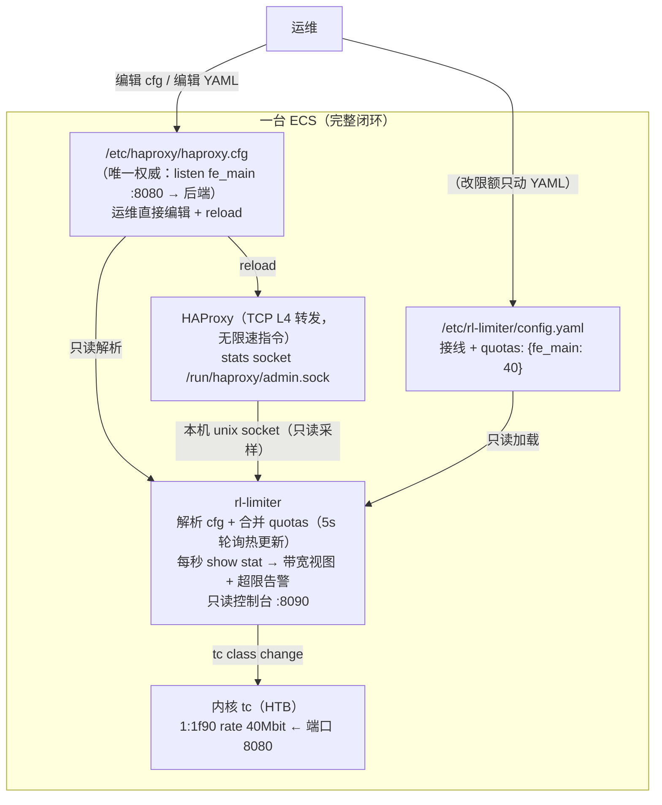

# 带宽计费限速管理 — 方案设计

> 对应需求：[00-需求说明.md](00-需求说明.md)
> 核心诉求：**HAProxy 层的下行带宽（代理请求返回给客户端的流量）不能高于约定带宽**。
> 原始需求中"限制新建连接"的手段经评审改为聚合整形（理由见 [02-建议与讨论点.md](02-建议与讨论点.md) §1）。

---

## 1. 背景与目标

### 1.1 两个要解决的问题

需求里其实包含两件事，本方案把它们拆开设计、一起交付：

1. **限速执行问题（数据面）**：实际下行带宽必须被约束在约定值以内，且要平滑（不能一刀切断流、不能来回抖动）。
2. **配置一致性问题（管理面）**：现状是"环境升级过很多回，后台数据一点没改"。限速的前提是限额与数据面**同源**，否则限的就是错的值。

### 1.2 设计目标

| 目标 | 指标（可调） |
| ---- | ---- |
| 节点下行带宽不超其带宽限制 | 10 秒滑动窗口均值 ≤ 100% 限制；瞬时毛刺 ≤ 110% |
| 限速平滑，不误伤 | 任何情况下不拒绝新建连接、不断开存量连接（资源过载保护除外）；改限额对存量连接即时生效 |
| 配置故障不影响数据面 | 配置文件短暂不可读时按最后一次配置继续限速（fail-static）；rl-limiter 宕机不影响已下发的限速 |
| 数据可信 | 限额只有一个登记入口（本机 YAML 的 quotas），实际用量可实时核对（持续超限告警） |

### 1.3 非目标（第一期不做）

- 不做单用户/单账号粒度的限速（那是 adapter 层的事，见建议文档）。
- 不做 gateway / adapter 层的带宽控制，只控 HAProxy 入口下行。
- 不替换现有计费出账系统，只提供实际用量数据。

---

## 2. 总体架构

**一台机器就是一个完整闭环**：HAProxy（转发）+ 内核 tc（限速）+ 同机的
rl-limiter（监控 + 限速下发），没有任何中心化组件、没有数据库。

- **haproxy.cfg（负载均衡配置的唯一权威）**：监听端口、模式、后端服务器
  由运维直接写在 cfg 里，改完 `systemctl reload haproxy`。rl-limiter
  只**读**它（`cfgparse` 模块解析 frontend/listen 段名、bind 端口、
  mode），**不渲染、不改写、没有受管区块**。
- **本机 YAML（rl-limiter 的配置）**：三类内容——stats socket 接线
  （怎么连本机 HAProxy）、`cfg_path`（haproxy.cfg 在哪）、**quotas 限额
  登记**（frontend 名 → Mbps）。
- **rl-limiter（Python，与 HAProxy 同机）**：把 cfg 解析出的清单与
  quotas 合并成运行期配置，然后：①**限速**——把限额下发到本机网卡的
  内核 tc（HTB，按监听端口分类，见 [06-tc限速方案.md](06-tc限速方案.md)）；
  ②**监控**——经本机 unix stats socket（`level user` 只读）每秒采样各
  frontend，产出带宽视图（内置只读 Web 控制台）并做持续超限告警。
  运行期轮询两个文件的内容（5s），变化即热生效。

**限速粒度（核心结论）**：**限额按 frontend（= 监听端口）设置**，与 tc
的分类机制一一对应——tc 按源端口（= 该 frontend 的监听端口）把出向流量
分到各自的 HTB 速率类。一台机器上可以有多个受管 frontend，各限各的、
互不影响；机器之间没有任何自动调配。cfg 里有、quotas 没登记的 frontend
**只监控不限速**。

> 为什么不做跨节点自动调配：按"各节点近期实测用量"加权动态分配额，在
> 对称饱和负载下会形成正反馈——权重来自实测速率，实测速率又是分配结果
> 本身，任何初始不均都会被逐轮放大直至锁死（强者愈强）。该机制已从设计
> 中移除；节点各自守住自己的限额，行为可预期、故障域清晰。



### 2.1 执行与监控的分工

| 环节 | 位置 | 周期 | 职责 |
| ------ | ---- | ---- | ---- |
| **限速执行** | 内核 tc（HTB，本机网卡出方向） | 实时（每个包过队列） | 该监听端口全部连接的总速率 ≤ 限额，与连接数/分布无关，存量连接持续受控 |
| **限速下发** | 同机的 rl-limiter 进程 | 配置一变即触发 + 30s 兜底 reconcile | 把 quotas 落到 tc 类（限额变更 = `tc class change`，即时、不断连接）；纠正手改 tc 造成的漂移 |
| **监控告警** | 同机的 rl-limiter 进程 | 1 秒 | 采样各受管 frontend → 10s 均值 vs 限额 → 持续超限告警 + 控制台实时视图 |

每台节点是一个完整的闭环单元：限速在本机内核里执行（不依赖任何外部
服务），监控也在本机进程内完成——一台节点的故障/超限不影响其它节点，
也不需要任何跨机调用。

**同机部署的代价与对策**：

| 风险 | 分析与对策 |
| ---- | ---------- |
| rl-limiter 崩溃 | **限速完全不受影响**（tc 规则在内核里）；只是本机监控/告警与限额调整暂停，systemd `Restart=always` 拉起 |
| HAProxy 重启导致 socket 短暂消失 | 采样失败按 fail-static 处理（沿用上一秒速率），连续 10s 失败标记 degraded 并暂停超限判定；socket 回来后自动收敛 |
| 监控进程与数据面抢资源 | rl-limiter 每秒一次 `show stat`、常驻内存只有 10 分钟快照环形缓冲，CPU/内存开销相对 HAProxy 可忽略；systemd unit 里以非特权用户运行、全只读文件系统 |
| 看不到兄弟节点 | 每台一个控制台，只管本机；跨机汇总对接外部监控系统 |
| 多机配置管理 | 配置就是两个本机文件，交给已有的配置管理（Ansible 等）分发；rl-limiter 幂等热加载 |

### 2.2 为什么配置权威是 haproxy.cfg 而不是数据库/服务

早期版本用 MySQL 做配置库、由 rl-limiter 渲染 cfg 受管区块并 reload。
去掉它们的理由：

1. **少一套系统**：数据库、bootstrap、控制台写接口、渲染与回滚逻辑全部
   消失；剩下的是运维本来就会的两件事——编辑 cfg + reload、编辑 YAML。
2. **消除双权威**：cfg 受管区块与库随时可能漂移（手改 cfg、渲染失败、
   reload 失败……），需要 reconcile + 回滚 + 漂移告警来弥合。cfg 直接
   作为唯一权威后，这一整类问题不存在了。
3. **限额调整本来就不走 cfg**：tc 改限额不需要 reload，把限额放在轻量
   的 YAML 里反而让"改限额"与"改转发"两类操作的影响面清晰分开。

代价：失去了 Web 界面改配置与集中配置库（多机统一视图/审计）。多机
分发交给配置管理工具；审计走文件的版本管理（git/etckeeper）。

---

## 3. 关键设计

### 3.1 带宽统计口径：用 HAProxy frontend 的 `bytes_out`，不用网卡计数

要控的是"**代理请求的返回流量**"（HAProxy → 客户端方向）。两种采集方式对比：

| 方式 | 问题 |
| ---- | ---- |
| 网卡计数（/proc/net/dev） | ECS 出流量混杂了发往 adapter 的上行请求、健康检查、管理流量，口径不纯；多网卡/单网卡部署差异大 |
| **HAProxy stats socket 的 frontend `bytes_out`（选用）** | 精确等于"HAProxy 发回客户端的字节数"，与计费口径一致 |

采集方式：同机的 rl-limiter 每秒通过**本机 unix stats socket** 执行
`show stat`，取各 frontend 的 `bytes_out` 累计值，差分得到每秒速率，按
**每个 frontend 各自**维护 **10 秒滑动窗口均值**（承诺口径，超限告警
判据）和 60 秒 EWMA（趋势观测）——一个 frontend 就是一个 tc 速率类，
与限速机制一一对应，不存在跨 frontend 的聚合。瞬时毛刺不直接触发任何
告警。

**前提：每台受控 HAProxy 必须开启 `option contstats`**（连续统计）。
HAProxy 默认在**会话结束时**才把该会话的字节计入 frontend 统计——TCP
L4 下全是长连接，`bytes_out` 会长期不动、断连时一次性跳变，逐秒差分
出来的速率变成 0 与巨大脉冲交替，与网卡实际流量（iptraf-ng 等工具所
见）完全对不上；开启后计数随数据转发连续推进，逐秒速率与网卡口径
实测仅差 TCP/IP 头开销（约 2~4%）。

> 注意口径换算：`bytes_out` 是应用层字节，tc 限的是链路层字节（含
> IP/TCP 头），监控读数本就应略低于限额、贴着跑属正常。与网卡级工具
> 对照时还需注意：网卡计数含全部端口/双向流量（含后端侧转发），
> rl-limiter 只统计受管 frontend 的下行方向。

### 3.2 限速执行机制：内核 tc（HTB）聚合限速，不拒绝新建连接

| 层级 | 手段 | 定位 |
| ---- | ---- | ---- |
| 主力：聚合限速 | 内核 tc **HTB**：网卡出方向建一棵队列树，按**源端口**（= frontend 监听端口）把流量分到各自的速率类，每类 `rate = ceil = 限额` | 带宽控制的唯一日常手段；限的是该端口全部连接的**总**速率，与连接数、单连接快慢、需求分布无关，**存量连接持续受控** |
| 资源保护 | frontend `maxconn`（cfg 里手写）按 ECS 规格静态标定（由内存/fd 容量反推，见 §3.4），**不是限速手段** | 防止限速导致并发连接堆积耗尽服务器资源 |
| 兜底类 | tc 的 default 类（无限速）承载本机未受管流量 | SSH/监控等管理流量不受任何整形影响 |

为什么是 tc 而不是 HAProxy 自带的 bwlim，以及映射方式、burst 取值、
单网卡/两网卡的部署前提、与 splice 的关系——完整的实测与推导见
[06-tc限速方案.md](06-tc限速方案.md)。一句话结论：**bwlim 会关闭
splice，同吞吐下 CPU 翻倍；且 shared bwlim 的 limit 是配置常量，改限额
要 reload、存量连接要等宽限期，而 tc 改限额即时生效**。

**TCP L4 特有语义**：服务端先关连接（如 HTTP `Connection: close`）时，
其 FIN 会与整形器尚未放完的数据竞争，客户端可能收到截断的响应。经限速
入口的流量应使用 keep-alive / 由客户端侧关闭连接。

**为什么不用"限制上行带宽"来实现**：对下行做整形后，TCP 背压会**自动**
把 HAProxy 从 adapter 收数据的速率压下来（机制见 §3.4），等效于自动完成
了上行方向的限制；而请求字节量与响应字节量的比例因业务差异极大，用上行
流量做控制旋钮无法稳定映射到下行带宽。

### 3.3 配置调整流程与持续超限告警

配置就是两个文件，两类操作影响面清晰分开：

```text
改限额（最常见）：
  编辑 YAML 的 quotas 段（fe_main: 40 → 20）
     ↓ 一个轮询周期内（≤5s）
  rl-limiter 执行 tc class change（就地改令牌速率，不动队列结构）
     ↓
  存量连接（含长连接）**立刻**按新限额跑；不 reload、连接不断。

改监听端口/后端服务器：
  编辑 haproxy.cfg → systemctl reload haproxy（HAProxy 固有流程）
     ↓ 一个轮询周期内（≤5s）
  rl-limiter 解析到 cfg 内容变化 → 更新监控清单与 tc 分类
  （新段开始被监控；要限速在 quotas 里加一行，先后顺序无所谓）。
```

要点：

- **变更检测按内容**（解析结果的规范化比较），不是 mtime——touch/原子
  替换不会触发空应用；文件读到一半（编辑瞬间）按 fail-static 跳过，
  下一轮重试。
- **持续 reconcile，而不是"变更时改一次"**：tc 下发幂等，除事件驱动外
  另有周期性兜底（默认 30s）——有人手动 `tc qdisc del` 也会被自动重建。
- **持续超限告警兜底检验一致性**：rl-limiter 发现 frontend 10s 均值持续
  （≥10s，带滞回）高于登记限额时打 warning 并在控制台高亮——通常意味着
  tc 下发失败（tcshaper 会另行报错）或口径问题；回落后自动解除。
  degraded（采样失联)期间判定暂停，陈旧数据不触发告警翻转。
- **YAML 的接线字段与 log_level 启动时定型**：运行期改动不热生效，
  检测到变化会打 warning 提醒重启（限额与 cfg 清单则全程热生效）。

### 3.4 整形会把流量堆在 HAProxy 上吗？（背压与资源分析）

结论：**不会无界堆积**。tc 队列有界（HTB 叶子的 fq_codel/pfifo），队列
满后丢包/延迟 ACK，TCP 拥塞控制把发送端压下来；HAProxy 向客户端写不出
去时停止从上游 socket 读取 → 内核接收缓冲填满 → TCP 窗口关小 → 压力
逐级背压到 adapter → gateway → 边缘节点，最终表现为**边缘节点从目标
网站的拉取速度被拖慢**——数据留在了源头而不是 HAProxy 上。

HAProxy 上的占用有界且可计算：

```text
每连接最大占用 ≈ tune.bufsize(16KB) + 内核 server 侧 rcvbuf + 内核 client 侧 sndbuf
```

真正的风险不是"流量堆积"，而是**并发连接数上升**：整形后每个请求的服务
时间变长，同样的请求到达率下在途连接数按 Little 定律升高。对应措施：

1. 按内存反推 maxconn（实测约 20 KB/连接，见 docs/03 §5.1）；
2. 监控并发连接数水位（控制台实例视图实时可见），水位过高提示扩容节点
   而不是收紧限速。

### 3.5 配置模型（两个本机文件，已实现）

| 文件 | 内容 | 热更新 |
| ---- | ---- | ---- |
| haproxy.cfg | frontend/listen 段：监听端口、模式、后端服务器（**唯一权威**，运维手写） | reload haproxy 后 rl-limiter ≤5s 自动跟上 |
| YAML `haproxy` 段 | stats socket 接线（socket_path 或 host/port + 超时）、cfg_path | 重启生效（采样客户端启动时定型，改动会记 warning） |
| YAML `quotas` 段 | frontend 名 → 限额（**Mbps**） | **热生效**（≤5s，tc class change） |
| YAML 运行参数 | log_level、tick_interval_s | 重启生效 |

合并与校验规则（`cfgparse` + `config` 模块强制）：

- quotas 的值必须 > 0（不想限速就删行，写 0 被拒绝——"0 = 不限"和
  "0 = 禁流"两种直觉都存在，干脆不允许）；
- cfg 解析刻意保守：只认 frontend/listen 段、每段取第一条 bind 的端口
  （多 bind warn）、mode 继承 defaults；看不懂的行忽略——cfg 的语法
  校验是 `haproxy -c` 的职责，不在这里重造；
- cfg 里有、quotas 没登记 → 只监控不限速（warn 一次）；quotas 登记了、
  cfg 里没有 → 忽略并 warn（段被删了或拼错，**绝不猜**）；
- YAML 写坏（接线两个都给、quotas 非数字…）→ 启动时直接失败点名字段；
  运行期整份新配置被拒绝，保留当前配置（fail-static）。

### 3.6 上线与灰度

限速按机器逐台开启，天然支持灰度：

1. **观测先行**：先部署 rl-limiter 但 quotas 留空——所有 frontend 只
   监控不限速，控制台直接看"实测用量"，暴露"升级过却没改数据"的存量
   烂账；
2. **逐台/逐端口开启**：往各机器的 quotas 里加行，加一行限一个端口；
3. **回退**：把那一行改成 0 或删掉（≤5s 撤掉该端口的 tc 类），或整机
   `RL_TC_IFACE=-` 关闭。

### 3.7 容错与失效行为

| 故障 | 行为 |
| ---- | ---- |
| haproxy.cfg / YAML 短暂不可读（原子替换瞬间、编辑到一半） | 保留当前配置继续运行（fail-static），warn 后下一轮（5s）重试 |
| 配置写坏 | 启动时：直接失败并点名字段；运行期：整份新配置被拒绝、保留当前配置继续跑并打日志 |
| rl-limiter 进程崩溃 | **限速完全不受影响**（tc 规则在内核里持续执行）；仅本机监控/告警与限额调整暂停，systemd `Restart=always` 拉起；其它节点完全不受影响 |
| tc 下发失败（网卡消失、权限丢失…） | tcshaper 告警并按兜底周期（30s）自动重试；已有的 tc 规则不受影响 |
| 有人手改/删了 tc 规则 | 周期性 reconcile 自动拉回登记值 |
| 整台节点宕机 | 该节点的限速与监控一起消失（本就没有流量经过它）；其它节点不受任何影响 |
| HAProxy 停止/重启，unix socket 消失 | 采样失败按 fail-static 沿用上一秒速率，连续 10s 失败标记 degraded 并在控制台标红、超限判定暂停；socket 回来后自动收敛。**tc 限速不受影响** |
| HAProxy reload（发版/改端口） | 转发由新 worker 按新 cfg 执行，tc 规则与 reload 无关；采集侧识别计数器回绕（沿用上一秒速率并重建基线），曲线无毛刺 |
| 时钟/计数回绕、采样超时 | 差分为负或采集失败的秒沿用上一秒速率；单次超时（默认 500ms）不拖累节拍 |

### 3.8 可观测性（内置只读 Web 控制台，已实现）

rl-limiter 内置 Web 控制台（`RL_CONSOLE_PORT` 启用，`RL_CONSOLE_BIND`
指定监听地址，**默认只绑 127.0.0.1**——控制台无鉴权；详见
[04-DockerCompose演示.md](04-DockerCompose演示.md)）。每台机器各有一个
控制台，展示本机那台 HAProxy：

- **各 frontend 的带宽视图**：每个受管 frontend 一张 1s 粒度实时曲线
  （实时速率 / 10s 均值 + 限额虚线），超限徽标、利用率、并发连接数、
  tc 队列的包/丢包统计、采样失联标记；
- **配置视图（只读）**：监听端点、模式、限额（cfg + quotas 的解析
  结果）——要改就改文件，页面不提供写操作；
- **实例视图**：整台 HAProxy 的连接/带宽/数据包曲线、stats socket
  端点与采样健康；
- **运行日志**：最近 1000 条结构化日志流式展示，按级别过滤（持续超限
  告警在此可见）；
- 同一套数据有只读 HTTP API（`/api/overview`、`/api/stream` SSE、
  `/api/history`），可脚本化取用。

监控数据共有**三个出口**（同一拍、同一份数据）：

1. **实时曲线**：控制台内存环形缓冲，最近约 10 分钟；
2. **Prometheus `/metrics`**：控制台同端口的抓取端点（文本 exposition
   格式，frontend/instance 两级 gauge）——长期存储、告警规则、Grafana
   大盘、跨机汇总都在 Prometheus 侧完成；
3. **本地日志落盘**（`RL_METRICS_LOG`）：分钟粒度 JSONL（avg/max/
   mean10_max/超限秒数，限额随行），按天轮转、默认保留 90 天——不依赖
   任何外部系统的历史回查/计费对账兜底。

历史查询界面、按天聚合报表属后续里程碑（§4 M4），建议在 Grafana/外部
系统侧完成。

---

## 4. 实施计划（里程碑）

| 阶段 | 内容 | 出口标准 |
| ---- | ---- | -------- |
| **M1 观测模式**（先看再限） | rl-limiter 全量部署、quotas 留空（只监控）；控制台观测各端口实测用量 | 全量节点覆盖；"约定带宽 vs 实测用量"的差异直接可见 |
| **M2 逐台灰度限速** | 按机器往 quotas 里登记限额，逐台放量 | 灰度节点总速率被压在限额内、存量连接即时受控，无客诉级抖动 |
| **M3 全量开启** | 全部节点登记限额；节点失联/reload/限额调整流程实测 | 全量节点受控；故障演练与 SOP 演练通过 |
| **M4 数据治理闭环** | 对接外部监控/告警系统：用量长期存储、超约告警→升级工单流程、多机汇总大盘 | 配额变更留痕（配置管理/git）；对账差异自动告警 |

### 5. 代码仓库

```
rl_limiter/       # Python 3.11 + asyncio 服务（与 HAProxy 同机）
  model.py        #   共享领域类型（单位约定、FrontendConfig、接线）
  haproxy.py      #   HAProxy runtime API 客户端（unix / TCP stats socket，只读采样）
  window.py       #   滑动窗口 + EWMA
  collector.py    #   每秒采样，按 frontend 产出用量；fail-static 与降级
  cfgparse.py     #   haproxy.cfg 解析（唯一权威）+ cfg/YAML 双文件轮询热更新
  tcshaper.py     #   限速下发：把限额落到本机网卡的 tc（HTB），按源端口分类
  config.py       #   YAML 配置解析与校验（接线 + quotas）
  webconsole.py   #   内置只读 Web 控制台（带宽曲线、实例视图、日志）
  loop.py         #   1s 监控主循环（采集 → 超限判定 → 发布）
tools/            # fake_haproxy.py（联调假节点，支持 unix / TCP）
                  # random_web.py、loadgen.py（compose 演示）
                  # tc_check.py（限速检查：plan / doctor / verify）
deploy/           # systemd unit（同机形态）、haproxy 完整配置示例、YAML 示例
  docker/         #   node-entrypoint.sh、haproxy-base.cfg、limiter-node.yaml
  sysctl/         #   tune-kernel.sh（内核参数调优）
  bare/           #   裸机一键装机脚本 + unit/env 模板
docs/
docker-compose.yml      # 单节点环境
docker-compose-demo.yml # 一键演示环境（详见 docs/04）
```
