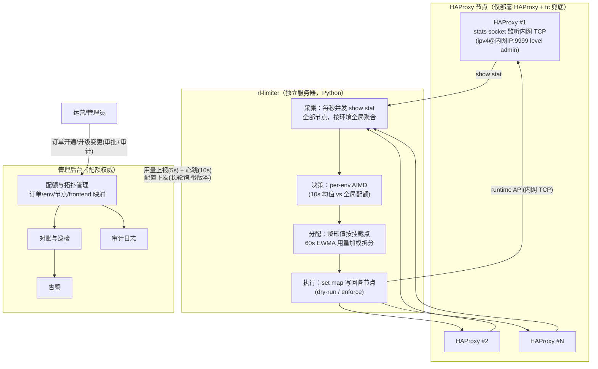
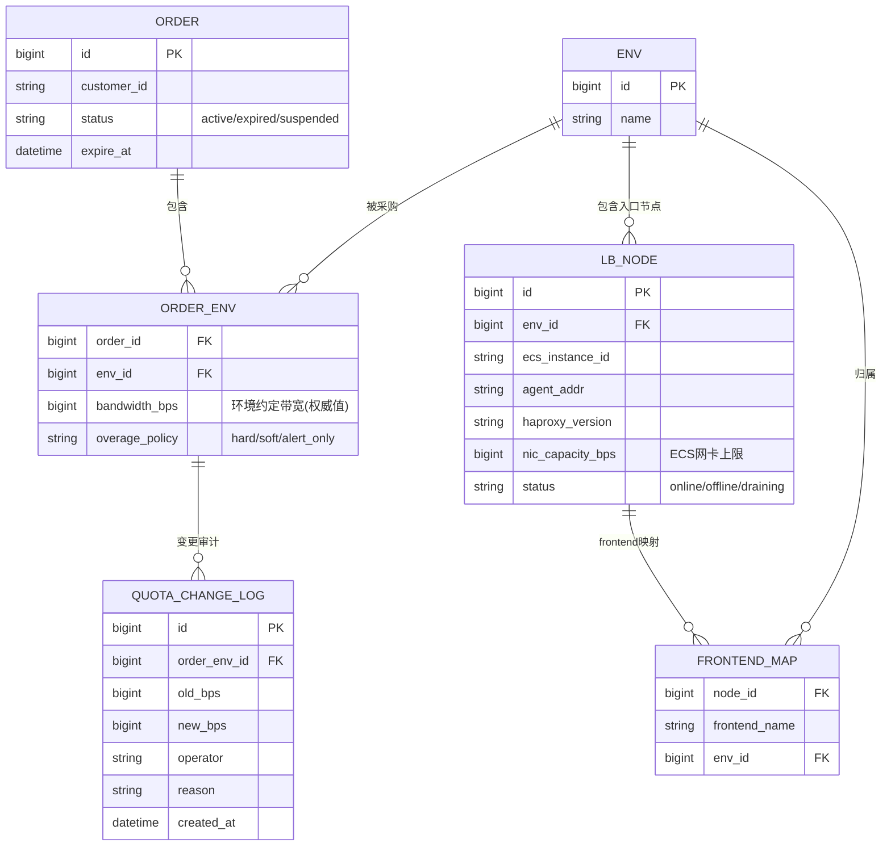

# 带宽计费限速管理 — 方案设计

> 对应需求：[00-需求说明.md](00-需求说明.md)
> 核心诉求：**HAProxy 层的下行带宽（代理请求返回给客户端的流量）不能高于环境约定带宽**。监控所有 haproxy 的出流量，超过环境约定带宽则限制新建连接，回落后恢复放行。

---

## 1. 背景与目标

### 1.1 两个要解决的问题

需求里其实包含两件事，本方案把它们拆开设计、一起交付：

1. **限速执行问题（数据面）**：环境的实际下行带宽必须被约束在约定值以内，且要平滑（不能一刀切断流、不能来回抖动）。
2. **计费数据治理问题（管理面）**：现状是"环境升级过很多回，后台数据一点没改"。限速的前提是后台有一份**权威、可审计、与现场一致**的配额数据，否则限的就是错的值。

### 1.2 设计目标

| 目标 | 指标（建议初始值，可调） |
| ---- | ---- |
| 环境下行带宽不超约定值 | 10 秒滑动窗口均值 ≤ 100% 配额；瞬时毛刺 ≤ 110% |
| 限速平滑，不误伤 | 带宽 < 90% 配额时不产生任何收紧动作；任何情况下不拒绝新建连接、不断开存量连接（资源过载保护除外） |
| 控制收敛快 | 超限后 ≤ 5 秒内开始收敛，≤ 30 秒回到配额内 |
| 控制面故障不影响数据面 | Agent 断联后按最后一次配置继续独立限速 |
| 数据可信 | 每次配额变更有审计记录；实际用量与后台配额自动对账 |

### 1.3 非目标（第一期不做）

- 不做单用户/单账号粒度的限速（那是 adapter 层的事，见建议文档）。
- 不做 gateway / adapter 层的带宽控制，只控 HAProxy 入口下行。
- 不替换现有计费出账系统，只提供权威配额数据和实际用量数据。

---

## 2. 总体架构（v2.0：集中式部署）

> **v2.0 重大调整**：限速服务不再以 Agent 形式与 HAProxy 同机部署，而是
> 作为独立服务（**rl-limiter**，Python 实现）部署在单独的服务器上，通过
> **内网 TCP** 连接并同时控制多台 HAProxy。v1.x 的"每节点 Agent 快环 +
> 中心慢环"两层结构随之**合并为一个集中式快环**（原因见 §2.1）。

系统由两部分组成：

- **rl-limiter（集中限速服务）**：独立部署，每秒并发采样所有受控 HAProxy
  节点，把同一环境分布在多台 HAProxy 上的流量**全局聚合**后做 AIMD 决策，
  再把整形值按各挂载点近期用量加权拆分，经 runtime API 写回各节点。
- **管理后台（配额权威）**：配额管理 → 配置下发（长轮询，带版本号）→
  用量数据沉淀/对账 → 审计 → 告警（职责不变）。



### 2.1 集中式快环（v2.0 取代原"快环+慢环"两层）

| 控制环 | 位置 | 周期 | 职责 |
| ------ | ---- | ---- | ---- |
| **全局快环** | rl-limiter | 1 秒 | 采样所有节点 → 环境**全局** 10s 均值 vs 配额 → AIMD 调整环境聚合整形值 → 按挂载点加权拆分写回各节点 |

两层合并的原因：限速服务本身就能同时看到所有节点，"环境总带宽"每秒即全局可见，原慢环存在的唯一理由（跨节点聚合需要上报汇总）消失了。原慢环的**配额分配算法保留**，降级为执行路径中的一个纯函数（allocator），每秒执行：

```text
输入: env_bwlim（本拍 AIMD 产出的环境聚合整形值）, 各挂载点近 60s EWMA 用量 usage[i]
保底: floor[i] = env_bwlim * 5% / N        # 每挂载点保底，防止饿死
剩余: rest = env_bwlim - Σfloor
分配: alloc[i] = floor[i] + rest * usage[i] / Σusage   # 按用量加权
     (Σusage == 0 时平均分配)
约束: Σalloc ≤ env_bwlim                   # 向下取整，保证环境总量不超
```

节点间流量不均（DNS 轮询不保证均匀）时，加权分配自动把额度从空闲节点挪给繁忙节点，避免"总量没超但某节点被冤枉限速"——且现在**每秒**再平衡一次，比原慢环的 5~10s 更及时。

**集中化的代价与对策（必须正视）**：

| 风险 | 分析与对策 |
| ---- | ---------- |
| rl-limiter 单点故障 | 服务宕机时各 HAProxy **保持最后写入的 map 值继续整形**（fail-static，不会放开限速），tc 硬兜底仍在各节点内核生效；systemd 自动拉起；后续可加冷备实例（主备通过后台心跳判活切换） |
| 限速服务 ↔ HAProxy 网络分区 | 失联节点的速率按最后值冻结参与聚合（§3.7），该节点 map 值保持不变；恢复后自动收敛 |
| runtime API 走内网 TCP 的安全 | stats socket `level admin` 端口只绑内网地址，安全组/防火墙仅放行 rl-limiter 所在服务器 IP；HAProxy 机器可另保留本机 unix socket 用于应急运维 |
| 控制时延 | 内网 RTT（<1ms 量级）相对 1s 控制周期可忽略；采样对全部节点并发执行，单节点慢不拖累整拍（超时 500ms 独立生效） |

---

## 3. 关键设计

### 3.1 带宽统计口径：用 HAProxy frontend 的 `bytes_out`，不用网卡计数

需求要控的是"**代理请求的返回流量**"（HAProxy → 客户端方向）。两种采集方式对比：

| 方式 | 问题 |
| ---- | ---- |
| 网卡计数（/proc/net/dev） | ECS 出流量混杂了发往 adapter 的上行请求、健康检查、管理流量、Agent 自身上报流量，口径不纯；多网卡/单网卡部署差异大 |
| **HAProxy stats socket 的 frontend `bytes_out`（选用）** | 精确等于"HAProxy 发回客户端的字节数"，与计费口径一致；且天然按 frontend 拆分，支持一台 haproxy 服务多个环境 |

采集方式：rl-limiter 每秒通过各节点的 TCP stats socket 并发执行 `show stat`，取各 frontend 的 `bytes_out` 累计值，差分得到每秒速率，按 (节点, frontend) → env 映射做**跨节点全局聚合**；在此之上维护 **10 秒滑动窗口均值**（承诺口径，快环决策输入）和 60 秒 EWMA（挂载点加权分配输入），瞬时毛刺不直接触发任何限速动作。

**frontend ↔ env 映射**：Controller 维护 `节点 + frontend 名 → env` 的映射表并随配置下发。一台 haproxy 只服务一个环境时映射是平凡的；将来一台 haproxy 复用给多个环境（不同端口/域名 = 不同 frontend）时，本方案不需要改动。

> 注意口径换算：`bytes_out` 是应用层字节。约定带宽如果按网络层算（含 TCP/IP 头，约 3~5% 开销），在配额上乘一个系数（如 0.95）即可，做成可配置项。

### 3.2 限速执行机制：常驻聚合整形为主，不拒绝新建连接

> v1.1 按评审意见修订：**正常路径不再拒绝/限制新建连接**。带宽控制统一由聚合整形完成，新老连接一视同仁地共享环境带宽——超限时的表现是"所有人整体变慢一点"，而不是"新用户被拒之门外"。

| 层级 | 手段 | 定位 |
| ---- | ---- | ---- |
| 主力：聚合整形 | HAProxy 原生 `filter bwlim-out` + 共享 stick-table（key 固定为 frontend 名 → 该 frontend 全部连接共享一个聚合额度）。**常驻生效**，限速值 = 节点配额 × 弹性系数（默认 1.10），由 Agent 按 10s 滑动均值动态微调（见 §3.3） | 带宽控制的唯一日常手段；新连接照常接入，与存量连接共享整形额度 |
| 资源保护 | frontend `maxconn` 按 ECS 规格静态标定（由内存/fd 容量反推，见 §3.4），**不是限速手段** | 防止整形导致并发连接堆积耗尽服务器资源；只有逼近容量上限时新连接才会排队，属过载保护 |
| 硬兜底 | tc（HTB/TBF）在公网网卡上限速为配额的 115% | 内核层硬保证，与 HAProxy 无关，防 Agent/HAProxy 异常；正常时永远打不到 |

**为什么不用"限制上行带宽"来实现（评审意见 2 的答复）**："上行"有两种理解，结论都是不需要显式去限：

1. 若指 **haproxy → adapter 的请求方向带宽**：请求字节量与响应字节量的比例因业务差异极大（几百字节的请求可能拉回几百 MB 的响应），用上行流量做控制旋钮无法稳定映射到下行带宽，控制会时松时紧、无法收敛。
2. 若指**限制 haproxy 从上游摄入数据的速率**：对下行做整形后，TCP 背压会**自动**把 haproxy 从 adapter 收数据的速率压下来（机制见 §3.4），等效于自动完成了上行方向的限制，无需再做一套显式机制。

因此设计定为：**直接整形下行（计费口径所在的方向），上行由背压自然收敛，新建连接不拒绝**。

其他说明：

- `bwlim-out` 需要 HAProxy ≥ 2.8（2.7 实验特性，2.8 起正式）。**建议全量升级到 2.8 LTS**；无法升级的存量节点降级为 tc 单层硬限（体验打折，仅作过渡）。
- tc 阈值 115% 高于弹性上限 110%，保证正常运行时两层不打架。

### 3.3 本地快环控制算法（Agent，每秒执行）

承诺口径（**已拍板**）：**10 秒滑动均值 ≤ 约定带宽，瞬时容忍至 110%**。因整形常驻，算法退化为对整形值的动态微调，仍保留 AIMD（急收慢放）防抖：

```text
输入: mean10 = 10s 滑动窗口均值速率（每秒更新一次）
      quota  = 控制面下发的本节点配额
      ceil   = quota × 1.10          # 弹性上限（可配）

常态:  bwlim = ceil                  # 允许瞬时/短时冲高到 110%
收紧:  mean10 > quota 持续 ≥ 3s:
          bwlim = max(quota × 0.95, bwlim × 0.9)   # 乘性收紧，把均值压回配额内
恢复:  mean10 < quota × 0.90 持续 ≥ 5s:
          bwlim = min(ceil, bwlim + quota × 0.05)  # 加性放松 5%/s，回到弹性上限
```

要点：

- **急收慢放（AIMD）**：超限时乘性收紧，恢复时加性放松，这是经 TCP 拥塞控制验证的稳定结构，防止"限速→带宽掉→放开→又超"的锯齿振荡。
- **不断开存量连接、不拒绝新建连接**：唯一例外是触发 §3.2 的资源保护 maxconn（那是容量问题，不是带宽问题）。
- 所有参数（1.10 / 0.90 / 3s / 5s / ×0.9 / +5%）由 Controller 下发，可按环境覆盖。

### 3.4 整形会把流量堆在 HAProxy 上吗？（评审问题 1：背压与资源分析）

关注点：对存量连接整形后，上游（adapter/gateway）还在继续送数据，是否会积压在 haproxy 服务器上导致异常？

结论：**不会无界堆积**。HAProxy 每条流的缓冲是固定大小（`tune.bufsize`，默认 16KB），向客户端写不出去时就停止从上游 socket 读取 → 内核接收缓冲填满 → TCP 窗口关小 → 压力逐级背压到 adapter → gateway → 边缘节点，最终表现为**边缘节点从目标网站的拉取速度被拖慢**——这正是全链路减速的期望效果，数据留在了源头而不是 haproxy 上。

haproxy 上的占用有界且可计算：

```text
每连接最大占用 ≈ tune.bufsize(16KB) + 内核 server 侧 rcvbuf + 内核 client 侧 sndbuf
```

真正的风险不是"流量堆积"，而是**并发连接数上升**：整形后每个请求的服务时间变长，同样的请求到达率下在途连接数按 Little 定律升高，"连接数 × 每连接缓冲"才是内存主项。对应措施：

1. 显式设置 `tune.rcvbuf.server` / `tune.sndbuf.client`（如 64KB），把每连接内核缓冲封顶，防止自动调优撑大；
2. 按内存反推 maxconn 标准值：如 8GB ECS 预留 4GB 给连接缓冲，每连接按 150KB 计 → maxconn ≈ 2.5 万；随 ECS 规格形成标准配置表（对应需求"不同带宽订单应有不同标准配置"），作为 §3.2 资源保护层的取值依据；
3. Agent 上报并监控：并发连接数/maxconn 水位、haproxy 进程 RSS、内核 socket 内存（`ss -m`），水位 > 80% 告警，提示扩容节点而不是收紧限速；
4. 背压的副作用：adapter/gateway 侧的发送缓冲同样会被顶住，属正常现象，无需处理。

### 3.5 数据模型（管理面）



配套约束与流程：

- **配额语义（已拍板）**：带宽配额以**环境**为粒度，每个环境必须有自己的配额并独立限速；**允许订单内各环境配额之和大于订单名义总带宽**（超售/弹性由商务侧把握），系统不做订单级汇总限制，订单带宽仅作商务参考字段。
- **配额变更只有一个入口**：管理后台的变更接口（带操作人、原因、审批），写 `QUOTA_CHANGE_LOG`，然后自动触发配置下发。杜绝"现场升级了、后台没改"——现场没有第二个改配额的通道。
- **容量校验**：变更时校验 `env 配额 ≤ Σ节点网卡能力 * 安全系数`，不满足则提示先扩容节点（对应需求中"不同带宽订单应有不同标准配置"）。
- 实时用量明细走时序库（Prometheus/VictoriaMetrics），关系库只存配置与审计。

### 3.6 rl-limiter ⇆ 管理后台接口（v2.0：主体由 Agent 变为集中限速服务，协议不变）

| 接口 | 方向 | 频率 | 内容 |
| ---- | ---- | ---- | ---- |
| `GET /v1/agent/config`（长轮询，带 `config_version`） | rl-limiter ← 后台 | 变更即回，否则 30s 超时重连 | 环境配额、env↔(节点,frontend) 挂载点映射、策略参数、模式；**带版本号，幂等应用**。HAProxy 节点连接信息（地址/超时/map 路径）属基础设施配置，仅在 rl-limiter 本地 YAML 维护，不随后台下发 |
| `POST /v1/agent/metrics` | rl-limiter → 后台 | 每 5s 批量（含每秒明细） | 各环境速率/均值/EWMA、连接数、当前整形值与状态、变更标记 |
| `POST /v1/agent/heartbeat` | rl-limiter → 后台 | 每 10s | 服务版本、运行模式、当前配置版本 |

安全：rl-limiter 与后台之间 mTLS 双向认证；rl-limiter 与各 HAProxy 之间的 runtime API 为内网 TCP（admin 级），只绑内网地址并用安全组仅放行 rl-limiter 服务器 IP。

### 3.7 容错与失效行为（v2.0 拓扑）

| 故障 | 行为 |
| ---- | ---- |
| rl-limiter ↔ 后台断联 | 按**最后一次下发的配置**继续限速（fail-static，启动时优先从本地缓存引导），绝不放开为不限速；恢复后先拉全量配置 |
| rl-limiter 进程/服务器宕机 | 各 HAProxy **保持最后写入的 map 值继续整形**（安全方向），tc 兜底仍在各节点内核生效；systemd 自动拉起；可选冷备实例接管 |
| rl-limiter ↔ 某台 HAProxy 网络分区/节点失联 | 该节点全部挂载点速率按最后值冻结参与环境聚合（不多分也不少分，保守），连续 10 秒失联标记该节点 degraded 并告警；涉及该节点的环境冻结整形值不动；恢复后自动收敛 |
| HAProxy reload（发版/改配置） | stick-table 用 `peers` 机制在 reload 间保留；计数器回绕由采集侧识别（沿用上一秒速率并重建基线），map 值由 pending 重试机制在 reload 窗口后自动补写 |
| 后台宕机 | rl-limiter fail-static；后台无状态化 + 多副本部署，配置存 DB |
| 时钟/计数回绕、单节点采样超时 | 差分为负或采集失败的秒，该节点沿用上一秒速率值；单节点超时（500ms）不拖累整拍其他节点 |

### 3.8 可观测性与用量数据沉淀

- rl-limiter 暴露 Prometheus 指标：`rl_rate_bps{env,node,frontend}`、`rl_quota_bps`、`rl_bwlim_bps`（当前整形值）、`rl_throttle_active`（是否处于收紧状态）、`rl_conn_current` / `rl_maxconn`（资源保护水位）。
- Grafana 大盘：环境视角（总用量 vs 配额、各节点堆叠）、节点视角（连接数/内存水位）、收紧事件流水。
- **用量数据入库供后台展示（已拍板）**：按环境/天聚合落库——峰值、P95、95 分位计费值、超约秒数、超约字节量、收紧事件次数；后台管理端提供环境用量页面与超约报表，同时作为升级线索推送和事后计费协商的数据源。原始秒级明细留存时序库（建议 90 天），聚合结果长期保存在关系库。
- 告警规则（初始）：
  - 环境用量 > 95% 配额持续 10 分钟 → 通知运营（**升级销售线索**，见建议文档 §5）；
  - 整形收紧状态持续 5 分钟 → 通知值班；
  - 连接数/内存水位 > 80%（见 §3.4）→ 提示扩容节点；
  - Agent 失联 > 1 分钟 / tc 兜底被打到 → 高优告警。

---

## 4. 实施计划（里程碑）

| 阶段 | 内容 | 出口标准 |
| ---- | ---- | -------- |
| **M1 观测模式**（先看再限） | rl-limiter 以 dry-run 全量接入采集上报；后台落数据模型 + 大盘 + 对账报表 | 全量节点覆盖；后台配额与实测用量的差异报表跑通（直接暴露"升级没改数据"的存量问题） |
| **M2 单节点限速** | 快环 + 常驻整形 / 资源保护 / tc 兜底，选 1~2 个环境灰度（先 dry-run 打日志，再真执行） | 灰度环境 10s 均值不超配额，无客诉级抖动 |
| **M3 多节点验证** | 跨节点环境的全局聚合 + 每秒加权分配（v2.0 已内建于快环）、节点失联保守策略实测 | 多 haproxy 环境总量受控，节点间流量不均时无误限 |
| **M4 数据治理闭环** | 变更审批+审计、容量校验、超约告警→升级工单流程 | 配额变更 100% 走后台留痕；对账差异自动告警 |

先 M1 后 M2 的原因：不需要任何风险动作就能先解决"后台数据与现实脱节"的痛点，同时为限速阈值调参积累真实数据。

---

## 5. 代码仓库规划（v2.0：Python 集中式服务）

```
rl_limiter/       # Python 3.11 + asyncio 集中限速服务
  model.py        #   共享领域类型（单位约定、Target/EnvQuota/Decision 等）
  haproxy.py      #   HAProxy runtime API 客户端（内网 TCP，每命令一连接）
  window.py       #   滑动窗口 + EWMA
  collector.py    #   多节点并发采样、按环境全局聚合、节点级容错
  governor.py     #   per-env AIMD 状态机（全局快环）
  allocator.py    #   整形值按挂载点加权分配（原慢环算法，降级为纯函数）
  executor.py     #   dry-run/enforce 执行、pending 重试、resync
  reporter.py     #   后台长轮询/上报/心跳、fail-static 缓存
  config.py       #   本地 YAML 配置（节点连接信息 + 引导配额）
  loop.py         #   1s 主循环（配置优先于 tick、周期状态汇总）
tools/            # fake_haproxy.py（联调假节点）、mock_backend.py（后台桩）
deploy/           # systemd unit、haproxy 配置片段(bwlim/TCP stats socket)、tc 脚本
docs/
```
