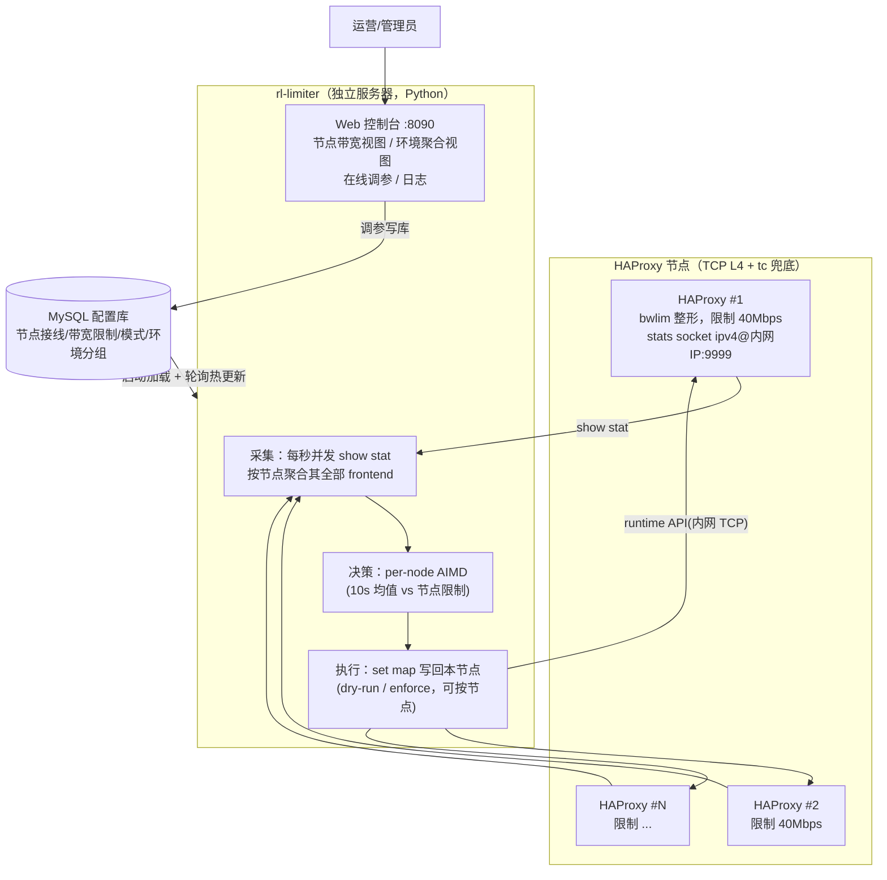

# 带宽计费限速管理 — 方案设计

> 对应需求：[00-需求说明.md](00-需求说明.md)
> 核心诉求：**HAProxy 层的下行带宽（代理请求返回给客户端的流量）不能高于约定带宽**。
> 原始需求中"限制新建连接"的手段经评审改为聚合整形（理由见 [02-建议与讨论点.md](02-建议与讨论点.md) §1）。

---

## 1. 背景与目标

### 1.1 两个要解决的问题

需求里其实包含两件事，本方案把它们拆开设计、一起交付：

1. **限速执行问题（数据面）**：实际下行带宽必须被约束在约定值以内，且要平滑（不能一刀切断流、不能来回抖动）。
2. **计费数据治理问题（管理面）**：现状是"环境升级过很多回，后台数据一点没改"。限速的前提是有一份**权威、可审计、与现场一致**的配额数据，否则限的就是错的值。

### 1.2 设计目标

| 目标 | 指标（可调） |
| ---- | ---- |
| 节点下行带宽不超其带宽限制 | 10 秒滑动窗口均值 ≤ 100% 限制；瞬时毛刺 ≤ 110% |
| 限速平滑，不误伤 | 带宽 < 90% 限制时不产生任何收紧动作；任何情况下不拒绝新建连接、不断开存量连接（资源过载保护除外） |
| 控制收敛快 | 超限后 ≤ 5 秒内开始收敛，≤ 30 秒回到限制内 |
| 配置面故障不影响数据面 | 配置库断联后按最后一次配置继续限速（fail-static） |
| 数据可信 | 配额只有一个修改入口（配置库/控制台），实际用量可实时核对 |

### 1.3 非目标（第一期不做）

- 不做单用户/单账号粒度的限速（那是 adapter 层的事，见建议文档）。
- 不做 gateway / adapter 层的带宽控制，只控 HAProxy 入口下行。
- 不替换现有计费出账系统，只提供权威配额数据和实际用量数据。

---

## 2. 总体架构

系统由三部分组成：

- **rl-limiter（集中限速服务，Python）**：独立部署，通过**内网 TCP**
  连接所有受控 HAProxy 的 stats socket；每秒采样、按节点做 AIMD 决策、
  把整形值经 runtime API 写回。内置 **Web 控制台**（实时曲线、在线调参、
  日志）。
- **MySQL 配置库（配额权威）**：节点接线、每节点带宽限制、模式、环境
  分组全部存库；rl-limiter 启动时加载、运行期轮询热更新。所有调整
  （控制台或直接改表）写库生效，现场没有第二个改配额的通道。
- **HAProxy 节点（数据面）**：TCP L4 负载均衡 + 原生 `bwlim-out` 过滤器
  执行整形；另有 tc 内核兜底，与 rl-limiter 无关。

**限速粒度（核心结论）**：**带宽限制按 HAProxy 节点设置，每台节点独立
调节，节点之间没有任何自动调配**。业务"环境"是节点的分组：一个环境可以
包含多台节点（节点是环境的独占资源，一台节点只服务一个环境），环境层面
只提供"聚合查看成员节点带宽之和"的只读视图。环境的总带宽 = 商务侧把
配额拆分到各成员节点之和——拆分是一次性的商务/运维决策，不是运行时的
自动行为。

> 为什么不做跨节点自动调配：按"各节点近期实测用量"加权动态分环境配额，
> 在对称饱和负载下会形成正反馈——权重来自实测速率，实测速率又是分配
> 结果本身，任何初始不均都会被逐轮放大直至锁死（强者愈强）。该机制已
> 从设计中移除；节点各自守住自己的限制，行为可预期、故障域清晰。



### 2.1 控制环

| 控制环 | 位置 | 周期 | 职责 |
| ------ | ---- | ---- | ---- |
| **节点快环** | rl-limiter | 1 秒 | 采样节点全部 frontend → 节点 10s 均值 vs 节点限制 → AIMD 调整节点整形值 → 写回该节点 map |

每台节点是一个独立的控制单元：采集聚合、AIMD 状态机、执行重试都以节点
为边界，一台节点的故障/超限/调参不影响其它节点。节点上有多个 frontend
时，节点整形值在节点**内部**按各 frontend 近 60s 用量加权拆分（含 5%
保底防饿死）；常规部署一台节点只挂一个业务 frontend，拆分是平凡的。

**集中式部署的代价与对策**：

| 风险 | 分析与对策 |
| ---- | ---------- |
| rl-limiter 单点故障 | 服务宕机时各 HAProxy **保持最后写入的 map 值继续整形**（fail-static，不会放开限速），tc 硬兜底仍在各节点内核生效；systemd 自动拉起 |
| rl-limiter ↔ HAProxy 网络分区 | 失联节点标记 degraded 并告警，其限速值冻结不动；恢复后自动收敛 |
| runtime API 走内网 TCP 的安全 | stats socket `level admin` 端口只绑内网地址，安全组/防火墙仅放行 rl-limiter 所在服务器 IP；HAProxy 机器可另保留本机 unix socket 用于应急运维 |
| 控制时延 | 内网 RTT（<1ms 量级）相对 1s 控制周期可忽略；采样对全部节点并发执行，单节点慢不拖累整拍（超时默认 500ms 独立生效） |

---

## 3. 关键设计

### 3.1 带宽统计口径：用 HAProxy frontend 的 `bytes_out`，不用网卡计数

要控的是"**代理请求的返回流量**"（HAProxy → 客户端方向）。两种采集方式对比：

| 方式 | 问题 |
| ---- | ---- |
| 网卡计数（/proc/net/dev） | ECS 出流量混杂了发往 adapter 的上行请求、健康检查、管理流量，口径不纯；多网卡/单网卡部署差异大 |
| **HAProxy stats socket 的 frontend `bytes_out`（选用）** | 精确等于"HAProxy 发回客户端的字节数"，与计费口径一致 |

采集方式：rl-limiter 每秒通过各节点的 TCP stats socket 并发执行
`show stat`，取各 frontend 的 `bytes_out` 累计值，差分得到每秒速率，按
节点聚合其全部挂载 frontend；在此之上维护 **10 秒滑动窗口均值**（承诺
口径，快环决策输入）和 60 秒 EWMA（节点内 frontend 拆分的输入），瞬时
毛刺不直接触发任何限速动作。

> 注意口径换算：`bytes_out` 是应用层字节。约定带宽如果按网络层算（含
> TCP/IP 头，约 3~5% 开销），把节点限制值调低相应比例即可。

### 3.2 限速执行机制：常驻聚合整形为主，不拒绝新建连接

| 层级 | 手段 | 定位 |
| ---- | ---- | ---- |
| 主力：聚合整形 | HAProxy 原生 `filter bwlim-out`（per-stream 模式 + runtime map）。**常驻生效**，整形值 = 节点限制 × 弹性系数（默认 1.10），由 rl-limiter 按 10s 滑动均值动态微调（§3.3）；每连接限速 = 整形值 / 当前连接数，动态均分 | 带宽控制的唯一日常手段；新连接照常接入，与存量连接共享整形额度 |
| 资源保护 | frontend `maxconn` 按 ECS 规格静态标定（由内存/fd 容量反推，见 §3.4），**不是限速手段** | 防止整形导致并发连接堆积耗尽服务器资源；只有逼近容量上限时新连接才会排队，属过载保护 |
| 硬兜底 | tc（TBF）在公网网卡上限速为节点限制的 115% | 内核层硬保证，与 HAProxy 无关，防 rl-limiter/HAProxy 异常；正常时永远打不到 |

**TCP L4 形态（生产实际）**：HAProxy 以 `mode tcp` 的 `listen` 段做四层
负载均衡，整形规则用 `tcp-request content` 在**连接建立时**执行一次
（变量用 sess 作用域）。两条 L4 特有语义：

1. **每连接限速在建连时定格**：runtime map 更新只影响新连接，存量长连接
   保持旧限速直至断开——AIMD 靠连接自然轮转收敛；长连接为主的业务需
   配合 tc 兜底。
2. **半关闭与整形的竞争**：服务端先关连接（如 HTTP `Connection: close`）
   时，其 FIN 会与 bwlim 过滤器尚未放完的整形数据竞争，客户端可能收到
   截断的响应。经整形入口的流量应使用 keep-alive / 由客户端侧关闭连接。

map 未命中的兜底：per-stream bwlim 过滤器只有在 `set-bandwidth-limit`
动作执行后才对该流启用，`default-limit` 不会自动兜住未启用的流——因此
配置里必须对 map 未命中（查表得 0）的连接补一条不带 limit 参数的动作，
让异常流落到保守的 1 MB/s 安全网（完整接线见
[deploy/haproxy/bwlim-example.cfg](../deploy/haproxy/bwlim-example.cfg)）。

**为什么不用"限制上行带宽"来实现**：对下行做整形后，TCP 背压会**自动**
把 HAProxy 从 adapter 收数据的速率压下来（机制见 §3.4），等效于自动完成
了上行方向的限制；而请求字节量与响应字节量的比例因业务差异极大，用上行
流量做控制旋钮无法稳定映射到下行带宽。

其他说明：

- `bwlim-out` 需要 HAProxy ≥ 2.8（2.7 实验特性，2.8 起正式）；无法升级的
  存量节点降级为 tc 单层硬限（体验打折，仅作过渡）。
- tc 阈值 115% 高于弹性上限 110%，保证正常运行时两层不打架。

### 3.3 节点快环控制算法（每秒执行）

承诺口径：**10 秒滑动均值 ≤ 节点带宽限制，瞬时容忍至 110%**。因整形
常驻，算法是对整形值的动态微调，用 AIMD（急收慢放）防抖：

```text
输入: mean10 = 该节点 10s 滑动窗口均值速率（每秒更新一次）
      quota  = 该节点的带宽限制（配置库 haproxy_nodes.quota_bps）
      ceil   = quota × 1.10          # 弹性上限（可配）

常态:  bwlim = ceil                  # 允许瞬时/短时冲高到 110%
收紧:  mean10 > quota 持续 ≥ 3s:
          bwlim = max(quota × 1.00, bwlim × 0.9)   # 乘性收紧，把均值压回限制内
恢复:  mean10 < quota × 0.90 持续 ≥ 5s:
          bwlim = min(ceil, bwlim + quota × 0.05)  # 加性放松 5%/s，回到弹性上限
```

要点：

- **急收慢放（AIMD）**：超限时乘性收紧，恢复时加性放松，这是经 TCP 拥塞
  控制验证的稳定结构，防止"限速→带宽掉→放开→又超"的锯齿振荡。
- **收紧下限 = 限制本身（×1.00）**：稳态吞吐即约定带宽，不给用户打折。
- **不断开存量连接、不拒绝新建连接**：唯一例外是触发 §3.2 的资源保护
  maxconn（那是容量问题，不是带宽问题）。
- 所有参数（1.10 / 0.90 / 3s / 5s / ×0.9 / 1.00 / +5%）可**按节点覆盖**
  （`haproxy_nodes.params_json`），控制台节点卡上可直接编辑。

### 3.4 整形会把流量堆在 HAProxy 上吗？（背压与资源分析）

结论：**不会无界堆积**。HAProxy 每条流的缓冲是固定大小（`tune.bufsize`，
默认 16KB），向客户端写不出去时就停止从上游 socket 读取 → 内核接收缓冲
填满 → TCP 窗口关小 → 压力逐级背压到 adapter → gateway → 边缘节点，最终
表现为**边缘节点从目标网站的拉取速度被拖慢**——数据留在了源头而不是
HAProxy 上。

HAProxy 上的占用有界且可计算：

```text
每连接最大占用 ≈ tune.bufsize(16KB) + 内核 server 侧 rcvbuf + 内核 client 侧 sndbuf
```

真正的风险不是"流量堆积"，而是**并发连接数上升**：整形后每个请求的服务
时间变长，同样的请求到达率下在途连接数按 Little 定律升高。对应措施：

1. 显式设置 `tune.rcvbuf.server` / `tune.sndbuf.client`（如 64KB），把每
   连接内核缓冲封顶；
2. 按内存反推 maxconn：如 8GB ECS 预留 4GB 给连接缓冲，每连接按 150KB 计
   → maxconn ≈ 2.5 万；随 ECS 规格形成标准配置表；
3. 监控并发连接数/maxconn 水位（控制台节点卡实时可见连接数），水位 > 80%
   告警，提示扩容节点而不是收紧限速。

### 3.5 配置数据模型（MySQL，已实现）

配置库四张表（建表与种子见
[deploy/mysql/init.sql](../deploy/mysql/init.sql)），rl-limiter 启动时
加载、运行期按 `RL_MYSQL_POLL_S`（默认 5s）轮询热更新：

| 表 | 内容 | 热更新 |
| ---- | ---- | ---- |
| `service_config` | 单行：实例标识、全局默认模式、日志级别、tick 周期 | mode 热生效，其余重启生效 |
| `haproxy_nodes` | 接线（host/port/map 路径/超时）+ 运行列（**quota_bps 节点带宽限制**、mode 节点模式覆盖、params_json 节点 AIMD 参数） | 运行列热生效；接线列重启生效 |
| `envs` | 业务环境分组（仅 env_id） | 热生效 |
| `env_targets` | 挂载点：环境 × 节点 × frontend | 热生效 |

结构性约束（统一校验管线强制，YAML 与数据库同规则）：

- 被挂载的节点必须设置有效的 `quota_bps`（> 0）；
- 同一 (节点, frontend) 只能属于一个环境（唯一键 + 校验）；
- **节点是环境的独占资源**：一个环境可横跨多台节点，一台节点只允许服务
  一个环境——混挂会让节点级模式切换同时波及两个环境、他环境流量逃出
  配额视野；
- 配置写错时 rl-limiter 保留当前配置继续限速（fail-static），绝不因坏
  配置放开限速；引用了运行期新增节点的配置会被拒绝热应用（节点接线在
  启动时构建，需重启完成接线）。

**变更唯一入口**：带宽调整只能通过配置库（控制台调参即写库）。现场改
机器改不了限速值——想给客户升级就必须先改库，数据被动保持一致。

管理面的订单/审计/对账数据模型（ORDER、QUOTA_CHANGE_LOG 等）属于后续
管理后台的范围，见 §4 里程碑 M4。

### 3.6 运行模式与灰度（按节点控制）

执行模式两档，粒度到**单台节点**：

- `dry-run`：只计算并记录本应写入的整形值，不真实写 map（观测模式，
  安全默认）；
- `enforce`：真实写入该节点 bwlim map。

全局默认模式（`service_config.mode`）+ 按节点覆盖
（`haproxy_nodes.mode`，NULL=继承全局）。**生产灰度的标准动作**：全局
默认留 dry-run，逐台把节点切到 enforce。某节点从 dry-run 切到 enforce
时，rl-limiter 对该节点做一次性全量重写（resync），消除演练期间的陈旧
map 值。

切到 dry-run 只是停止更新 map：enforce 期间最后写入的整形值仍留在
HAProxy 里继续限速（fail-static 方向，服务绝不主动放开限速）。

### 3.7 容错与失效行为

| 故障 | 行为 |
| ---- | ---- |
| rl-limiter ↔ 配置库断联 | 按**最后一次加载的配置**继续限速（fail-static）；启动阶段等待数据库就绪（最长 120s，凭据/依赖类永久错误立即失败）；单次拉取有整体超时，静默网络分区不会卡死轮询 |
| rl-limiter 进程/服务器宕机 | 各 HAProxy **保持最后写入的 map 值继续整形**（安全方向），tc 兜底仍在各节点内核生效；systemd 自动拉起 |
| rl-limiter ↔ 某台 HAProxy 网络分区/节点失联 | 该节点速率按最后值冻结，连续失联标记 degraded 并在控制台标红；该节点整形值冻结不动；恢复后自动收敛。其它节点完全不受影响（控制单元隔离） |
| HAProxy reload（发版/改配置） | map 值由 pending 重试机制在 reload 窗口后自动补写；计数器回绕由采集侧识别（沿用上一秒速率并重建基线） |
| 时钟/计数回绕、单节点采样超时 | 差分为负或采集失败的秒，该节点沿用上一秒速率值；单节点超时（默认 500ms）不拖累整拍其他节点 |

### 3.8 可观测性（内置 Web 控制台，已实现）

rl-limiter 内置 Web 控制台（`RL_CONSOLE_PORT` 启用，详见
[04-DockerCompose演示.md](04-DockerCompose演示.md)）：

- **节点带宽视图**：每台节点一张 1s 粒度实时曲线（实时速率 / 10s 均值 /
  整形值 + 限制虚线），AIMD 状态徽标、收紧次数、超限秒数、利用率、并发
  连接数、失联标记；带宽限制与 AIMD 参数就地编辑（写库热生效）；
- **环境聚合视图**：每环境一张只读聚合曲线（成员节点各序列求和）+
  挂载点管理（增删/迁移，节点独占规则由前后端双重强制）；
- **节点面板**：接线、所属环境、带宽限制、按节点模式下拉、采样健康；
- **运行日志**：最近 1000 条结构化日志流式展示，按级别过滤；
- 同一套数据有 HTTP API（`/api/overview`、`/api/stream` SSE、
  `/api/history`），可脚本化取用。

Prometheus 指标端点、Grafana 大盘、按环境/天的用量聚合入库（峰值、P95、
超约秒数/字节量）与告警规则属后续里程碑（§4 M4），设计意图不变：用量
长期贴近限制的客户就是升级销售线索（见建议文档 §5）。

---

## 4. 实施计划（里程碑）

| 阶段 | 内容 | 出口标准 |
| ---- | ---- | -------- |
| **M1 观测模式**（先看再限） | rl-limiter 以 dry-run 全量接入采集；控制台观测各节点用量 vs 限制 | 全量节点覆盖；"配置的限制 vs 实测用量"的差异直接可见（暴露"升级没改数据"的存量问题） |
| **M2 逐节点灰度限速** | 全局默认 dry-run，按节点逐台切 enforce；tc 兜底就位 | 灰度节点 10s 均值不超其限制，无客诉级抖动 |
| **M3 全量 enforce** | 全部节点 enforce；节点失联/HAProxy reload 等容错行为实测 | 全量节点受控；故障演练通过 |
| **M4 数据治理闭环** | 管理后台：变更审批+审计、容量校验、用量聚合入库、超约告警→升级工单流程 | 配额变更 100% 留痕；对账差异自动告警 |

### 5. 代码仓库

```
rl_limiter/       # Python 3.11 + asyncio 集中限速服务
  model.py        #   共享领域类型（单位约定、Target/EnvQuota=控制单元/Decision 等）
  haproxy.py      #   HAProxy runtime API 客户端（内网 TCP，每命令一连接）
  window.py       #   滑动窗口 + EWMA
  collector.py    #   多节点并发采样、按控制单元聚合、节点级容错
  governor.py     #   per-node AIMD 状态机
  allocator.py    #   节点整形值在节点内按 frontend 加权拆分（含保底）
  executor.py     #   dry-run/enforce 执行（按节点模式）、pending 重试、resync
  dbconfig.py     #   MySQL 配置源（启动加载 + 轮询热更新 + 控制台写回）
  config.py       #   配置解析与校验（YAML 与数据库共用同一管线）
  webconsole.py   #   内置 Web 控制台（节点/环境视图、在线调参、日志）
  reporter.py     #   可选管理后台通道（长轮询/上报/心跳、fail-static 缓存）
  loop.py         #   1s 主循环（配置优先于 tick、周期状态汇总）
tools/            # fake_haproxy.py、mock_backend.py（联调）
                  # random_web.py、loadgen.py（compose 演示）
deploy/           # systemd unit、haproxy L4 配置示例、tc 脚本、mysql/init.sql、
                  # docker/（compose 演示用 HAProxy 配置与 map 种子）
docs/
docker-compose.yml # 一键演示环境（详见 docs/04）
```
